# Точка маршрутизации

Рекомендуемая версия платформы: 8.3.25.1394.

[Документация](./docs/index.md)

[Релизы](https://github.com/MadRave/route-point/releases)

Библиотека позволяет создавать **endpoint'ы** (точки подключения) для **различных клиентов** с целью перенаправления входящих запросов на **внешние сервисы API** и **адаптировать ответы API** в ожидаемые клиентами структуры данных.


## Какую проблему решаем?

Есть несколько различных клиентов, для которых нужно настроить взаимодействие с определенным API поставляемым внешним сервисом. Клиентами могут быть *различные базы 1С*, *сайты* и *прочие системы*. Каждый клиент ожидает ответ внешнего сервиса API в *определенном формате*, а также вызывает *различные методы API*, не совпадающие с вызовами других клиентов.

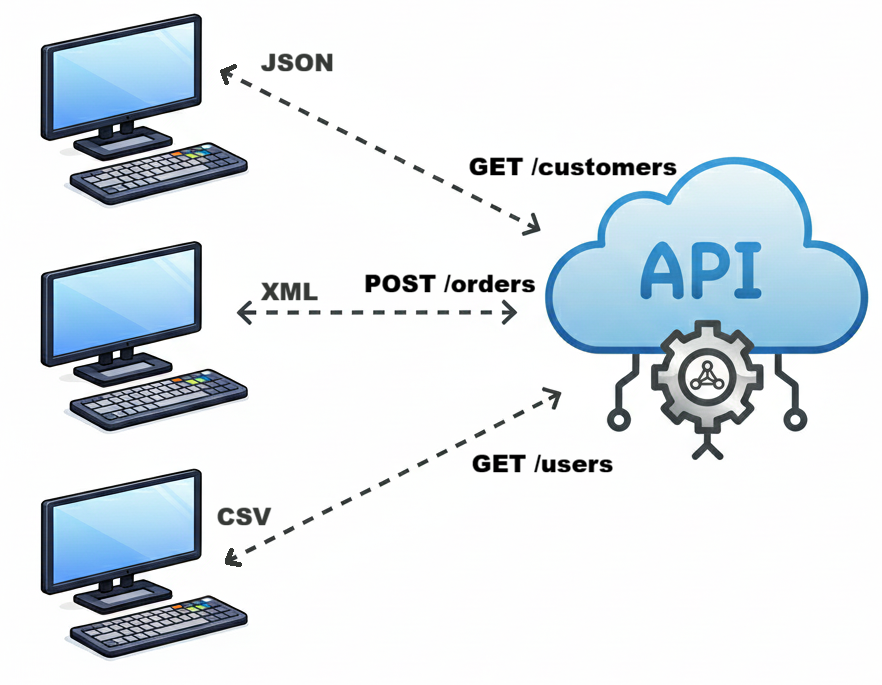

**"Решение в лоб"** подразумевает настройку интеграции с API на стороне каждого клиента. Также требуется адаптация ответа API в структуру данных, которая требуется конкретному клиенту.

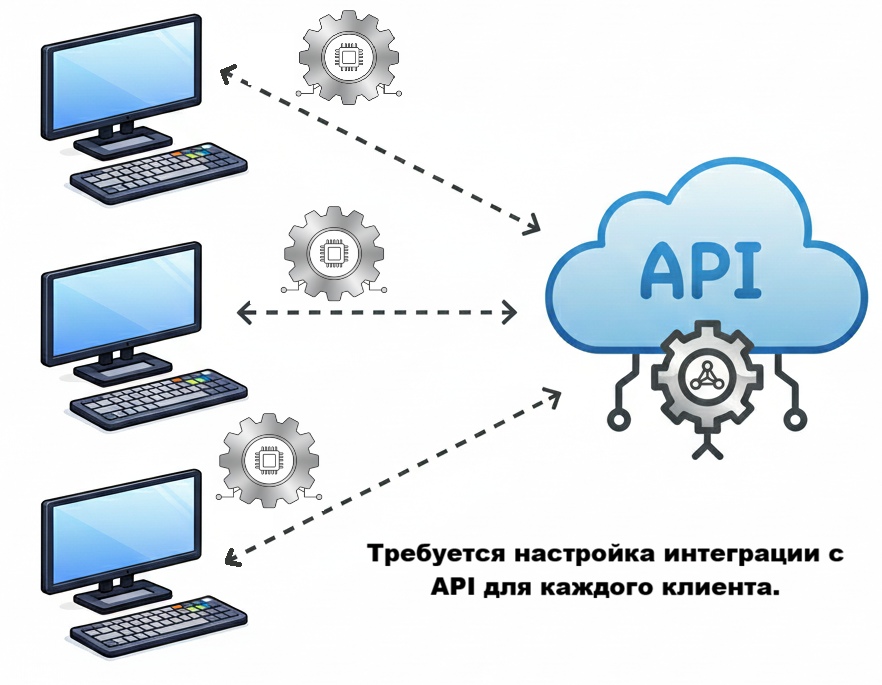

Из данного решения вытекают следующие проблемы:
- **Сложная поддержка клиентов в случае изменения API**. Например, у внешнего сервиса изменился адрес URL, поменялись endpoint'ы, изменились порты, форматы ответов и т.д. Для **каждого клиента** нужно перенастроить интеграцию с внешним сервисом. Если клиентов много, это может стать проблематично.
- **Подключение новых клиентов путем копирования существующей интеграции**. Для подключения новых клиентов необходимо настроить интеграцию на стороне нового клиента с сервисом API. Это может подразумевать копирование уже существующего решения интеграции с API от другого клиента, где уже интеграция настроена.
- **Адаптация ответа внешнего сервиса API на стороне клиента**. Внеший сервис может возвращать большой объем данных, который не требуется клиенту. Для получения только необходимых клиенту данных потребуется извлечь из ответа сервиса API нужную информацию.   

Библиотека **Точка маршрутизации** позволяет решить перечисленые проблемы:
- **Интеграция с API внешнего сервиса находится в одном месте**. Благодаря этому, в случае изменения каких-либо составляющих API внешнего сервиса, достаточно скорректировать интеграцию с сервисом **только один раз** без доработки внешних клиентов.

    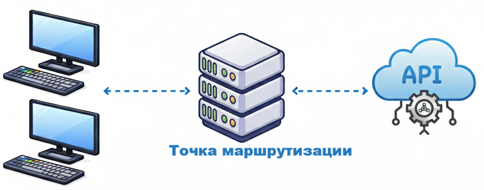

- **Простое подключение новых клиентов внешнего сервиса API**. При подключении нового клиента достаточно написать обращение к определенному ресурсу **точки маршрутизации** для взаимодействия с внешним сервисом. Поскольку **вся настойка интеграции расположена на стороне точки маршрутизации**, то для подключения нового клиента не требуется сложной настройки взаимодействия с API внешнего сервиса.

    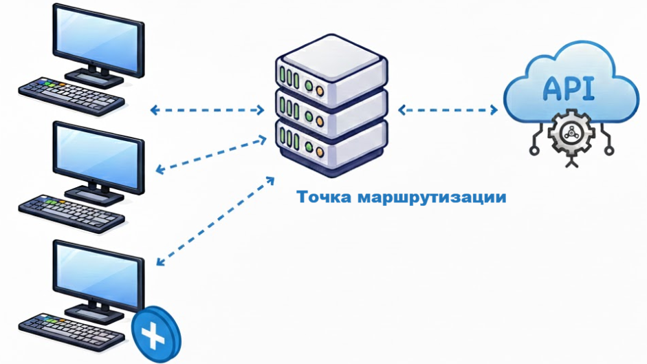

- **Отправка подготовленного ответа внешнего сервиса, который требуется клиенту**. При отправке ответа клиенту на стороне **точки маршрутизации** есть возможность предварительно привести ответ внешнего сервиса API к требуемому формату, исключить из ответа лишние данные. Таким образом, клиент получит только необходимые данные в нужном формате. 

    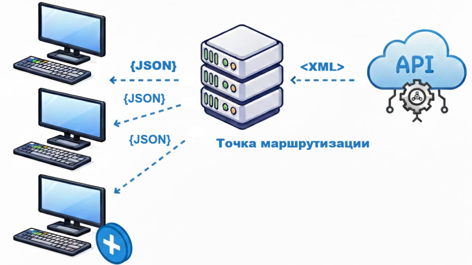

## Как это работает?

Потребуется информационная база 1С с внедренной библиотекой **Точка маршрутизации**. Этот компонент выполняет следующие функции:
- Принимает входящие запросы от клиентов
- Перенаправляет запросы на API внешнего сервиса
- Получает ответ от API внешнего сервиса и подготавливает его для клиента. Подготовленный и отформатированный ответ возвращает клиенту

    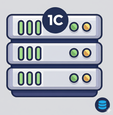

Клиенты отправляют запросы на адрес, по которому опубликован http-сервис из библиотеки **Точка маршрутизации**. Шаблон такого url может быть таким:
```
http://<ip-адрес хоста>/<имя публикации>/hs/api-gateway/{Идентификатор внешнего сервиса}/{Идентификатор прикладной операции}
```

Здесь:
- **Ip-адрес хоста** - ip-адрес, на котором выполнена публикация http-сервиса **точки маршрутизации**
- **Имя публикации** - имя публикации на веб-сервере. Задается в конфигураторе при публикации http-сервиса библиотеки (*Администрирование - Публикация на веб-сервере - Имя (поле на вкладке "Основные")*)
- **api-gateway** - корневой URL http-сервиса библиотеки
- **Идентификатор внешнего сервиса** - идентификатор, по которому можно определить внешний сервис, к API которого нужно выполнить запрос. Задается в справочнике *внешних сервисов* библиотеки
- **Идентификатор прикладной операции** - идентификатор, определяющий модуль, в котором описана логика взаимодействия с API внешнего сервиса и выполняется подготовка итогового ответа клиенту. Задается в справочнике *внешних сервисов* библиотеки

### Модуль API и модуль прикладной операции

Основными составляющими взаимодействия между клиентом и внешним сервисом являются **модуль API** и **модуль прикладной операции**. Это *внешние обработки*, в которых описана логика взаимодействия с API внешнего сервиса и обработка запросов клиентов. Поскольку это *внешние обработки*, то внесение изменений в логику работы, возможно **в любой момент без обновления конфигурации**.

- **Модуль API** - это *внешняя обработка*, которая содержит процедуры и функции вызова методов API внешнего сервиса, например, получение токена авторизаций, вызов различных методов из документации к API. Методы модуля API описываются в программном интерфейсе модуля объекта обработки.
- **Модуль прикладной операции** - это *внешняя обработка*, которая содержит точку входа обработки входящего запроса от клиента, логику взаимодействия с API внешнего сервиса через **Модуль API** и подготовку итогового ответа для клиента. В рамках модуля можно реализовать обработку следующих видов входящих http-запросов от клиентов:
    - GET
    - POST
    - PUT
    - DELETE
    - PATCH

Схематично взаимодействие между клиентом и API внешнего сервиса можно описать так:

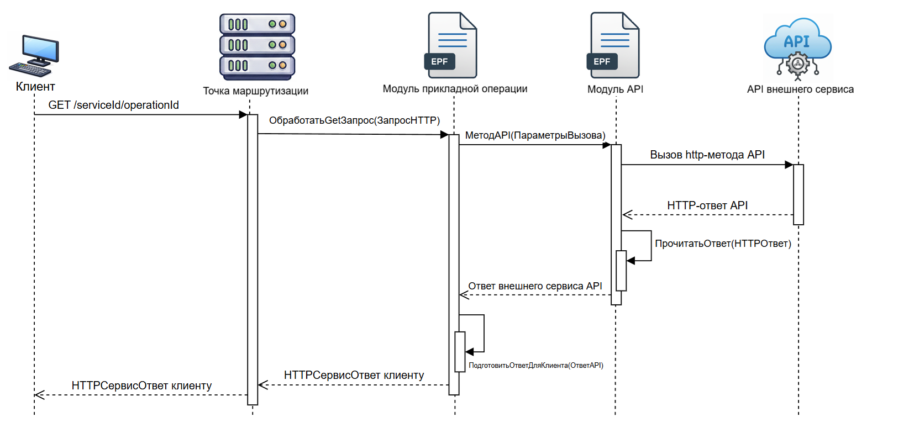

На диаграмме показана следующая последовательность действий:

1. Клиент отправляет http-запрос на url-адрес http-сервиса библиотеки, указав идентификаторы:
    - **serviceId** - идентификатор внешнего сервиса, к API которого нужно выполнить запрос. Задается при добавлении информации о сервисе в справочник *Внешние сервисы* библиотеки
    - **operationId** - идентификатор прикладной операции, которую нужно выполнить. Задается при добавлении информации о сервисе в справочник *Внешние сервисы* библиотеки

2. Входящий http-запрос клиента передается в **модуль прикладной операции** в событие *ОбработатьGETЗапрос()*. В модуле прикладной операции также содержатся обработчики других видов запросов: *POST, PUT, PATCH, DELETE*
3. Для отправки запросов к **API внешнего сервиса** модуль прикладной операции вызывает экспортные процедуры и функции **модуля API**, в которох реализовано непосредственное обращение к API внешнего сервиса. На диаграмме такая функция указана как *МетодAPI()*. Название может быть любым и устанавливается разработчиком при написании экспортных процедур и функций *модуля API*
4. В **модуле API** выполняется обращение к **исходным методам API внешнего сервиса**. Полученный ответ от внешнего сервиса преобразуется в структуру данных 1С (соответствие, структура и т.п.) либо из ответа извлекаются строковые, бинарные и прочие данные. На диаграмме это выполняется в процедуре *ПрочитатьОтвет()* (указана только для примера, чтение http-ответа может выполняться в любом другом месте модуля API)
5. Данные ответа внешнего сервиса передаются в **модуль прикладной операции**. После получения информация из ответа фильтруется и преобразуется в запрашиваемый клиентом формат (для примера перечисленные действия на диаграмме выполняются в процедуре *ПодготовитьОтветДляКлиента()* модуля прикладной операции). Итоговый результат помещается в *HTTPСервисОтвет* и возвращатеся клиенту.

### Описание внешнего сервиса

Описание внешнего сервиса включает следующие компоненты:
 - **Идентификатор внешнего сервиса** - строковый идентификатор, позволяющий однозначно идентифициовать внешний сервис, к API котрого нужно выполнить запрос. Указывается в параметре **serviceID** url клиентского запроса
 - **Модуль API** - внешняя обработка, в которой реализовано непосредственное обращение к методам **API внешнего сервиса**
 - **Прикладные операции** - совокупность внешних обработок, в которых реализована обработка входящих клиентских запросов, взаимодействие с API внешнего сервиса через **модуль API**, подготовка итогового результата для клиента. Элемент совокупности прикладных операций состоит из:
    - **Идентификатор операции** - строковый идентификатор, по которому можно идентифицировать выполняемую прикладную операцию. Указывается в параметре **operationId** url клиентского запроса
    - **Модуль операции** - внешняя обработка прикладной операции. Здесь реализована обработка входящего запроса клиента, взаимодействие с API внешнего сервиса через **модуль API** и подготовка итогового результата для клиента.

Ключевые особенности описания внешнего сервиса:
1. Внешний сервис однозначно определяется по **идентификатору внешнего сервиса**, который указывается в параметре **serviceId** клиентского запроса
2. Описание внешнего сервиса может содержать **только один модуль API**
3. Описание внешнего сервиса может содержать **множество различных прикладных операций**, которые взаимодействуют с API сервиса только через **один и тот же модуль API**. Выполняемая прикладная операция однозначно определяется по **идентификатору операции**, который указывается в параметре **operationId** клиентского запроса. 

Схематично описание внешнего сервиса можно представить так:

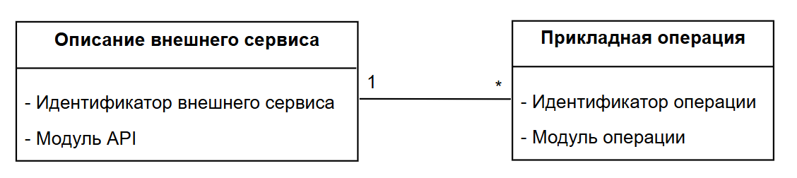

Описания внешних сервисов хранятся в справочнике **Внешние сервисы** библиотеки

## Пример использования

Рассмотрим использование библиотеки на примере взаимодействия с API Яндекс.Погода. Решим задачу по формированию html-страницы погоды в Набережных Челнах и формированию JSON-структуры погоды в Москве.
1. Создадим **модуль API** содержащий экспортные методы по взаимодействию с API Яндекс.Погода. Для примера основной метод взаимодействия с API - функция *ПрогнозПогоды()*

    ```bsl

    #Область ПрограммныйИнтерфейс

    // Возвращаемое значение:
    //   - Структура:
    //
    Функция НовыеПараметрыПолученияПрогноза() Экспорт
        
        ПараметрыПолученияПрогноза = Новый Структура;
        // ... описываем параметры получнения прогноза
        
        Возврат ПараметрыПолученияПрогноза;
        
    КонецФункции

    // https://yandex.ru/dev/weather/doc/ru/concepts/forecast-rest
    // Выполняет обращение к сервису API Яндекс Погода
    //
    // Параметры:
    //  ПараметрыПолученияПрогноза - Структура - см. НовыеПараметрыПолученияПрогноза()
    // 
    // Возвращаемое значение:
    //   - Строка - JSON с данными прогноза погоды
    //   - Неопределено - в случае ошибки
    //
    Функция ПрогнозПогоды(ПараметрыПолученияПрогноза) Экспорт
        
        // ... здесь выполняем реализацию обращения к API Яндекс.Погода
        
    КонецФункции

    #КонецОбласти

    ```

2. Создадим **модуль прикладной операции** по формированию html-страницы погоды в Набережных Челнах. Страницу будем возвращать в ответ на входящий GET-запрос клиента, поэтому реализуем обработчик события *ОбработатьGETЗапрос()* в модуле объекта внешней обработки

    ```bsl

    #Область ОбработчикиСобытий

    // Точка входа обработки GET-запроса
    //
    // Параметры:
    //  ЗапросHTTP - HTTPСервисЗапрос - входящий GET-запрос для обработки
    // 
    // Возвращаемое значение:
    //   - HTTPСервисОтвет - результат выполнения текущей прикладной операции
    //
    Функция ОбработатьGETЗапрос(ЗапросHTTP) Экспорт
        
        СтраницаПрогноза = СформироватьСтраницуПрогнозаПогодыВНабережныхЧелнах();
        
        Если СтраницаПрогноза = Неопределено Тогда
            // ... формируем ответ с ошибкой
        КонецЕсли;
        
        Заголовки = Новый Соответствие;
        Заголовки.Вставить("Content-type", "text/html;charset=utf-8");
        
        Ответ = Новый HTTPСервисОтвет(200, , Заголовки);
        Ответ.УстановитьТелоИзСтроки(СтраницаПрогноза, КодировкаТекста.UTF8);
        
        Возврат Ответ;
        
    КонецФункции

    #КонецОбласти

    #Область СлужебныеПроцедурыИФункции

    // Формирует страницу погоды в Набережных Челнах по данным сервиса Яндекс.Погода
    // 
    // Возвращаемое значение:
    //   - Строка - разметка html страницы погоды
    //   - Неопределено - в случае ошибки
    //
    Функция СформироватьСтраницуПрогнозаПогодыВНабережныхЧелнах()
        
        ПараметрыПолученияПрогноза = МодульAPI.НовыеПараметрыПолученияПрогноза();
        // .. заполняем параметры для получения прогноза
        
        // Взаимодействуем с внешним сервисом через МодульAPI
        ПрогнозJSON = МодульAPI.ПрогнозПогоды(ПараметрыПолученияПрогноза);
        
        Если ПрогнозJSON = Неопределено Тогда
            Возврат Неопределено;
        КонецЕсли;
        
        Чтение = Новый ЧтениеJSON;
        Чтение.УстановитьСтроку(ПрогнозJSON);
        
        ДанныеПрогноза = ПрочитатьJSON(Чтение, Истина);
        
        Чтение.Закрыть();
        
        // .. на основании данных прогноза формируем html-страницу
        
    КонецФункции

    #КонецОбласти

    ```

3. Аналогично создадим **модуль прикладной операции** для получения погоды в Москве

    ```bsl

    #Область ОбработчикиСобытий

    // Точка входа обработки GET-запроса
    //
    // Параметры:
    //  ЗапросHTTP - HTTPСервисЗапрос - входящий GET-запрос для обработки
    // 
    // Возвращаемое значение:
    //   - HTTPСервисОтвет - результат выполнения текущей прикладной операции
    //
    Функция ОбработатьGETЗапрос(ЗапросHTTP) Экспорт
        
        ПогодаВМоскве = ПогодаВМоскве();
        
        Если ПогодаВМоскве = Неопределено Тогда
            // ... формируем ответ с ошибкой
        КонецЕсли;
        
        Заголовки = Новый Соответствие;
        Заголовки.Вставить("Content-type", "application/json;charset=utf-8");
        
        Ответ = Новый HTTPСервисОтвет(200, , Заголовки);
        Ответ.УстановитьТелоИзСтроки(ПогодаВМоскве, КодировкаТекста.UTF8);
        
        Возврат Ответ;
        
    КонецФункции

    #КонецОбласти

    #Область СлужебныеПроцедурыИФункции

    // Формирует JSON-строку с информацией о погоде в Москве
    // 
    // Возвращаемое значение:
    //   - Строка - JSON-строка
    //
    Функция ПогодаВМоскве()
        
        ПараметрыПолученияПрогноза = МодульAPI.НовыеПараметрыПолученияПрогноза();
        // .. заполняем параметры для получения погоды в Москве
        
        // Взаимодействуем с внешним сервисом через МодульAPI
        ПрогнозJSON = МодульAPI.ПрогнозПогоды(ПараметрыПолученияПрогноза);
        
        Если ПрогнозJSON = Неопределено Тогда
            Возврат Неопределено;
        КонецЕсли;
        
        // .. формируем строку JSON с информацией о погоде в Москве
        
    КонецФункции

    #КонецОбласти

    ```

4. Внешние обработки **модуля API**  и **модулей прикладных операций** добавляем в информационную базу библиотеки в справочник внешних обработок. Если информационная база разработана на основе БСП и включает подсистему *дополнительные отчеты и обработки*, то разработанные модули на шагах 1-3 нужно загрузить в справочник *Дополнительные отчеты и обработки*

    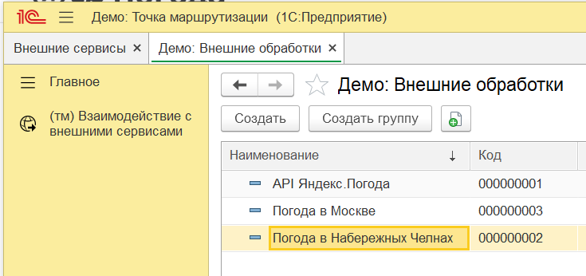

5. Добавляем **описание внешнего сервиса** Яндекс.Погода в справочник *Внешние сервисы* информационной базы 1С с внедренной библиотекой **Точка маршрутизации**

    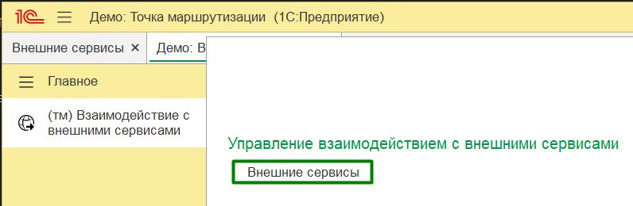

    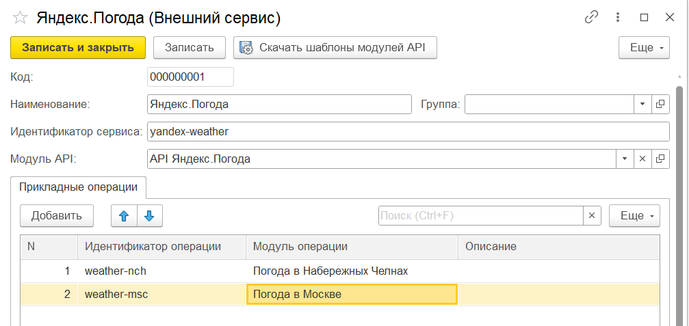

    Заполняем **идентфикатор внешнего сервиса, модуль API, модули и идентификаторы прикладных операций**.

6. Проверяем. Для того чтобы получить html-страницу с погодой в Набережных Челнах необходимо отправить GET-запрос по адресу:

    ```
    http://<ip-адрес хоста>/<имя публикации на веб-сервере>/hs/api-gateway/yandex-weather/weather-nch
    ```

    А для погоды в Москве GET-запрос по адресу

    ```
    http://<ip-адрес хоста>/<имя публикации на веб-сервере>/hs/api-gateway/yandex-weather/weather-msc
    ```

    Получим следующий результат:

    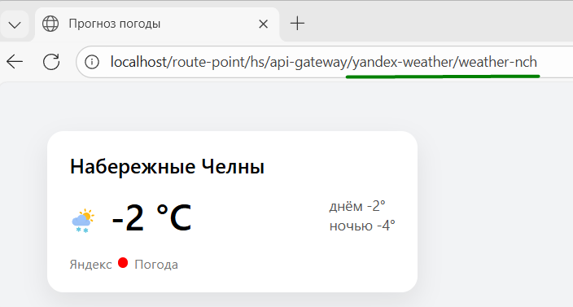

    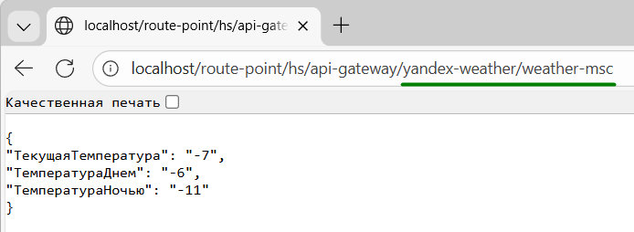

    ## Альтернативный вариант использования библиотеки

    Библиотеку **Точка маршрутизации** можно использовать в качестве простого способа развертывания точки подключения к текущей информационной системе 1С для других клиентов (*сайты, другие информационные базы 1С, прочие системы*).

    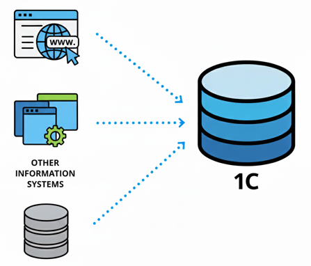

    Когда это может потребоваться:

    - **Отправка данных на сайт по запросу**. Достаточно создать точку подключения (*прикладную операцию*) с обработкой GET-запроса, описать алгоритм формирования данных и предоставить ответ в запрашиваемом формате
    - **Обработка входящих web-hook'ов**. Можно бысто создать и описать логику обработки входящего web-hook'а от других систем. **При этом не требуется создавать отдельного http-сервиса**. Логику обрабработки можно поменять в любой момент, т.к. используются внешние обработки.
    - **Реализация http-интерфейса для взаимодействия с frontend'ом**. Простой способ добавить endpoint'ы для взаимодействия с frontend'ом по протоколу http.
    - **Альтернатива oData**. C помощью библиотеки можно предоставить REST-интерфейс для взаимодействия с другими системами, не заморачиваясь с oData (Кто вообще использует oData? :)

    Плюсы использования библиотеки:
    - **Быстрое создание endpoint'ов без обновления конфигурации текущей базы 1С** - достаточно один раз внедрить библиотеку в текущую информационную базу 1С и выполнить публикацию http-сервиса api-gateway из библиотеки.
    - **Изменение и добавление логики обработки входящих запросов в любой момент** - вся логика обработки входящих запросов находится во внешних обработках, поэтому вносить изменения и добавлять новый функционал можно в любой момент. **Без обновления конфигурации**.

    ### Пример использования

    Рассмотрим концепцию возможного использования библиотеки в качестве инструмента для реализации REST-интерфейса к информационной базе 1С.
    Предположим, необходимо реализовать http-интерфейс по управлению заказами покупателей. В рамках интерфейса нужно реализовать методы по получению актуальных заказов, добавлению новых заказов, изменению и удалению определенного заказа.

    1. Создадим внешнюю обработку **модуля API**. В модуле обработки нужно реализовать экспортные методы по управлению заказами покупателей:

        ```bsl
        #Область ПрограммныйИнтерфейс

        // Возвращает информацию об актуальных заказах покупателей
        // 
        // Возвращаемое значение:
        //   - ТаблицаЗначений:
        //       * ИдентификаторЗаказа - Строка - уникальный идентификатор документа ЗаказПокупателя
        //       * НомерЗаказа - Строка
        //       * ДатаЗаказа - Дата (дата и время)
        //       * СуммаЗаказа - Число (15, 2)
        //       * ИдентификаторКлиента - Строка - уникальный идентификатор элемента справочника Контрагенты
        //
        Функция АктуальныеЗаказыПокупателей() Экспорт
            
            // здесь реализуем логику формирования данных заказов покупателя
            
        КонецФункции

        Функция НовыеДанныеЗаказаПокупателя() Экспорт
            
            ДанныеЗаказаПокупателя = Новый Структура;
            //... формирование структуры заказа покупателя
            
        КонецФункции

        // Создает новый документ ЗаказПокупателя с указанными данными
        //
        // Параметры:
        //  ДанныеЗаказаПокупателя - Структура - см. НовыеДанныеЗаказаПокупателя()
        // 
        // Возвращаемое значение:
        //   - Структура:
        //       * Успешно - Булево
        //       * ИдентификаторЗаказа - Строка - уникальный идентификатор документа ЗаказПокупателя
        //       * ТекстОшибки - Строка - заполняется в случае ошибки
        //
        Функция СоздатьНовыйЗаказПокупателя(ДанныеЗаказаПокупателя) Экспорт
            
            // Реализуем логику создания нового заказа покупателя
            
        КонецФункции

        // Обновляет данные указанного заказа покупателя
        //
        // Параметры:
        //  ИдентификаторЗаказа - Строка - уникальный идентификатор документа ЗаказПокупателя, данные которого нужно обновить
        //  ДанныеЗаказаПокупателя - Структура - информация заказа покупателя для обновления. См. НовыеДанныеЗаказаПокупателя()
        // 
        // Возвращаемое значение:
        //   - Структура:
        //       * Успешно - Булево
        //       * ТекстОшибки - Строка - заполняется в случае ошибки
        //
        Функция ОбновитьДанныеЗаказаПокупателя(ИдентификаторЗаказа, ДанныеЗаказаПокупателя) Экспорт
            
            // ... здесь логика перезаписи заказа покупателя
            
        КонецФункции

        // Отменяет указанный заказ покупателя
        //
        // Параметры:
        //  ИдентификаторЗаказа - Строка - идентификатор документа ЗаказПокупателя, который нужно отменить
        // 
        // Возвращаемое значение:
        //   - Структура:
        //       * Успешно - Булево
        //       * ТекстОшибки - заполняется в случае ошибки
        //
        Функция ОтменитьЗаказПокупателя(ИдентификаторЗаказа) Экспорт
            
            // ... здесь реализуем логику отмены заказа покупателя
            
        КонецФункции

        #КонецОбласти
        ```

   2. Создадим внешнюю обработку *модуля прикладной операции* - реализуем обработчики запросов *GET, POST, PUT, DELETE*

        ```bsl
        #Область ОбработчикиСобытий

        // Точка входа обработки GET-запроса
        //
        // Параметры:
        //  ЗапросHTTP - HTTPСервисЗапрос - входящий GET-запрос для обработки
        // 
        // Возвращаемое значение:
        //   - HTTPСервисОтвет - результат выполнения текущей прикладной операции
        //
        Функция ОбработатьGETЗапрос(ЗапросHTTP) Экспорт
            
            // ...
            
            АктуальныеЗаказы = МодульAPI.АктуальныеЗаказыПокупателей();
            
            // ... формируем ответ
            
        КонецФункции

        // Точка входа обработки POST-запроса
        //
        // Параметры:
        //  ЗапросHTTP - HTTPСервисЗапрос - входящий POST-запрос для обработки
        // 
        // Возвращаемое значение:
        //   - HTTPСервисОтвет - результат выполнения текущей прикладной операции
        //
        Функция ОбработатьPOSTЗапрос(ЗапросHTTP) Экспорт
            
            // ... получаем входящие данные
            
            ДанныеЗаказаПокупателя = МодульAPI.НовыеДанныеЗаказаПокупателя();
            // ... заполняем данные заказа
            
            РезультатСоздания = МодульAPI.СоздатьНовыйЗаказПокупателя(ДанныеЗаказаПокупателя);
            
            // ... формируем ответ
            
        КонецФункции

        // Точка входа обработки PUT-запроса
        //
        // Параметры:
        //  ЗапросHTTP - HTTPСервисЗапрос - входящий PUT-запрос для обработки
        // 
        // Возвращаемое значение:
        //   - HTTPСервисОтвет - результат выполнения текущей прикладной операции
        //
        Функция ОбработатьPUTЗапрос(ЗапросHTTP) Экспорт
            
            // ... получаем входящие данные
            
            ДанныеЗаказаПокупателя = МодульAPI.НовыеДанныеЗаказаПокупателя();
            // ... заполняем данные заказа
            
            РезультатОбновления = МодульAPI.ОбновитьДанныеЗаказаПокупателя(ИдентификаторЗаказа, ДанныеЗаказаПокупателя);
            
            // ... формируем ответ
            
        КонецФункции

        // Точка входа обработки DELETE-запроса
        //
        // Параметры:
        //  ЗапросHTTP - HTTPСервисЗапрос - входящий DELETE-запрос для обработки
        // 
        // Возвращаемое значение:
        //   - HTTPСервисОтвет - результат выполнения текущей прикладной операции
        //
        Функция ОбработатьDELETEЗапрос(ЗапросHTTP) Экспорт
            
            // ... получаем входящие данные
            
            РезультатОтмены = МодульAPI.ОтменитьЗаказПокупателя(ИдентификаторЗаказа);
            
            // ... формируем ответ
            
        КонецФункции

        #КонецОбласти
        ```
 
    3. Загрузим созданные модули на шагах 1-2 в справочник внешних обработок

        

    4. Добавим внешний сервис с созданными модулем API и прикладной операции

        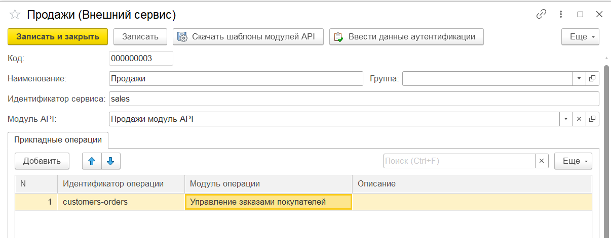


В результате станет доступным REST-интерфейс к текущей информационной базе 1С по управлению заказами покупателей:

```
http://<ip-адрес хоста>/<имя публикации>/hs/api-gateway/sales/customers-orders
```

Данный ресурс может обрабатывать запросы *GET, POST, PUT, DELETE*
  
    
