# Внедрение библиотеки Точка маршутизации

## 01. Внедрение библиотеки в конфигурацию

1. Выполнить сравнение-объединение с cf-файлом поставки библиотеки **Точка Маршрутизации** (*Конфигурация - Сравнить, объединить с конфигурацией из файла*). 

    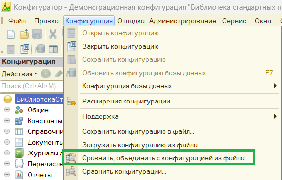

2. При появлении предупреждения о поставке на поддержку выбрать **Да**

    

3. В окне сравнения-объединения отключить выбор отмеченных объектов нажав на корень конфигурации

    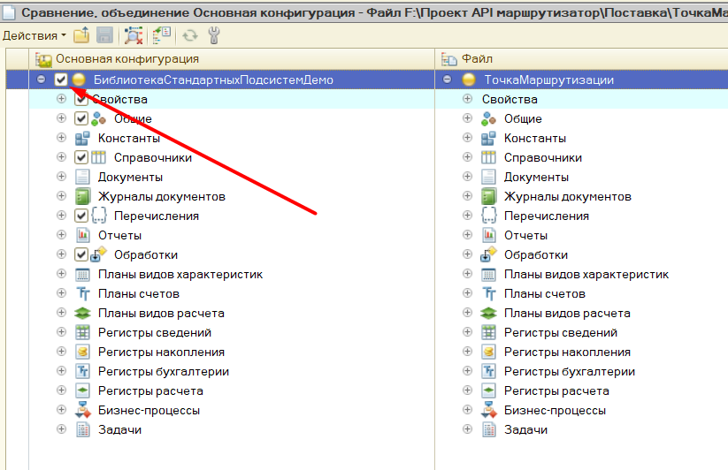

    Убедитесь, что отметки были сняты:

    

4. Перейдите в меню *Действия* и выберите *Отметить по подсистемам файла*:

    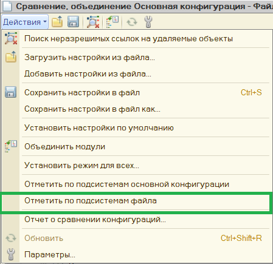

    В открывшемся окне выберите подсистему **УправлениеВзаимодействиемСВнешнимиСервисами**. Если текущая информационная баз разработана с использованием БСП, то также нужно отметить подсистему **ИнтеграцияБСП**. Для других конфигураций подсистема **ИнтеграцияБСП** не обязательна:

    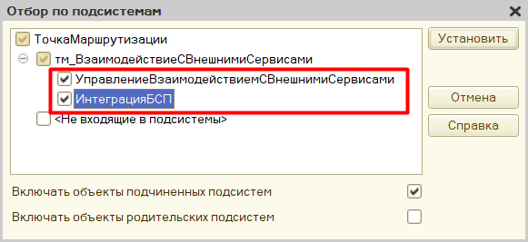

    Нажмите кнопку **Установить**

5. В окне сравнения-объединения нажмите кнопку **Выполнить**

    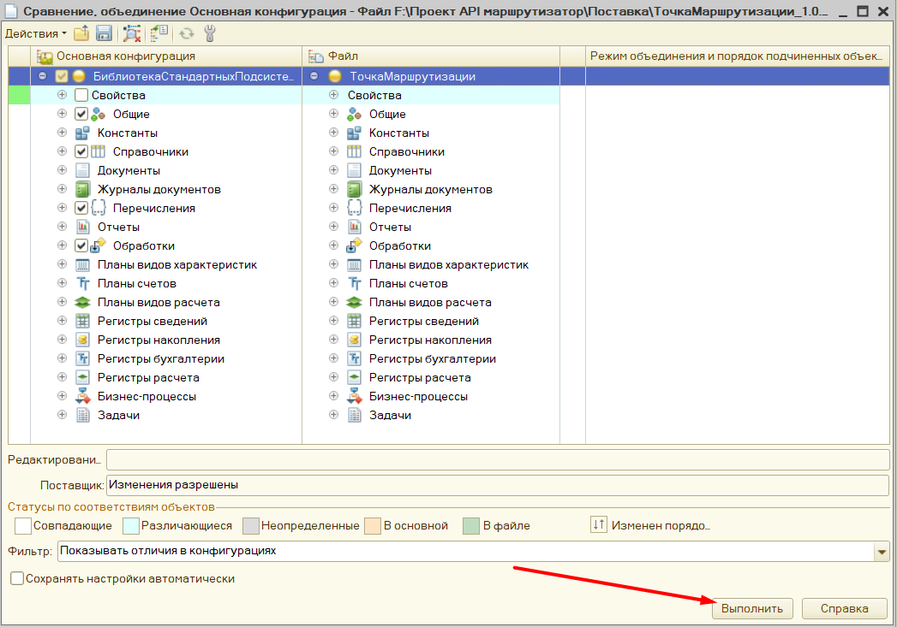

    В появившемся окне настройки поддержки нажмите **Ок**

    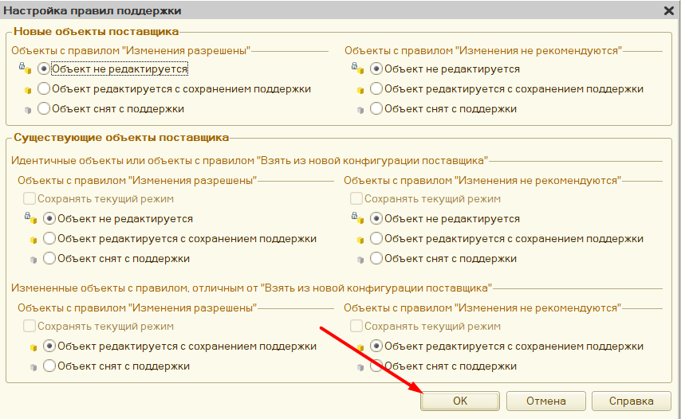

6. Выполните обновление конфигурации нажав на кнопку *Обновить конфигурацию базы данных*

    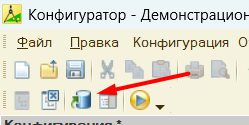

    В появившемся окне нажмите **Принять**

    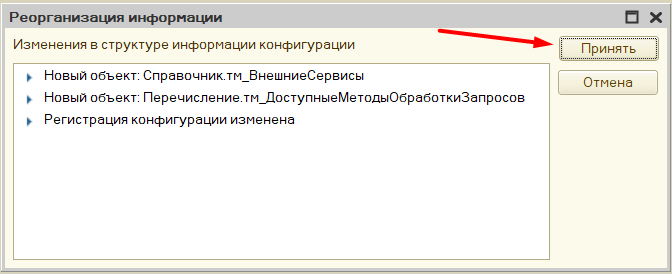

Готово! Объекты библиотеки можно посмотреть, выполнив отбор по подсистемам **УправлениеВзаимодействиемСВнешнимиСервисами** и **ИнтеграцияБСП**

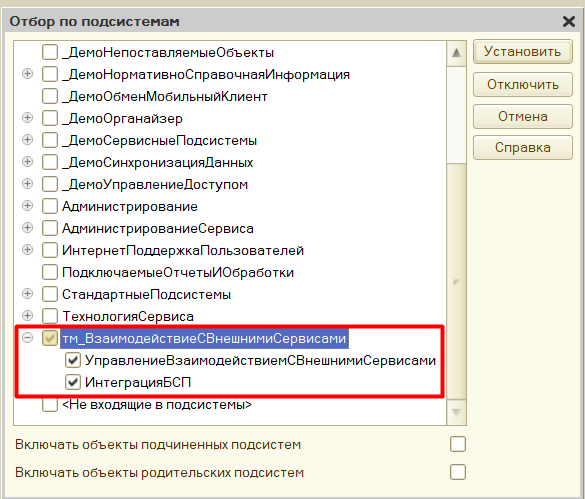

## 02. Настройка объектов библиотеки

Перед началом работы необходимо выполнить настройку объектов библиотеки:

1. Если конфигурация разработана с использованием БСП, то библиотеку **Точка маршрутизации** необходимо добавить в модули подсистем. Для этого в общем модуле **ПодсистемыКонфигурацииПереопределяемый** нужно дополнить обработчик *ПриДобавленииПодсистем* следующим кодом:

    ```bsl
    Процедура ПриДобавленииПодсистем(МодулиПодсистем) Экспорт
        
        //...

        МодулиПодсистем.Добавить("ОбновлениеИнформационнойБазыТочкаМаршрутизации");

    КонецПроцедуры
    ```

    После обновляем конфигурацию базы данных и запускаем сеанс с параметром **/ЗапуститьОбновлениеИнформационнойБазы**. Параметр можно установить в меню *Сервис - Параметры - Запуск 1С:Предприятия*:

    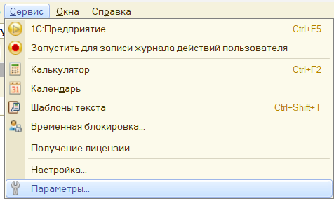

    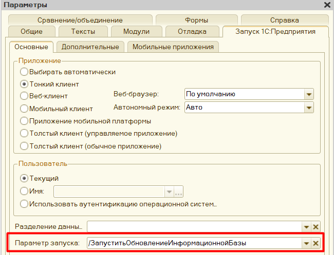

    Сеанс в этом случае можно запустить через отладку. 
    После выполнения обработчиков обновления в регистре сведений **Версии подсистем** появится информация о библиотеки **Точка маршрутизации**

    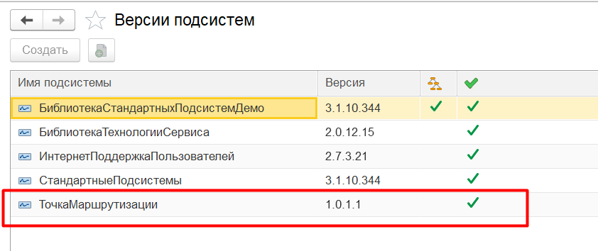


2. Необходимо определиться со справочником внешних обработок, в котором будут храниться внешние обработки **модулей API** внешних сервисов и **модулей прикладных операций**. Если информационная база разработана с использованием БСП, то в качестве такого справочника подойдет справочник *ДополнительныеОтчетыИОбработки*. В других конфигурациях без использования БСП нужно предусмотреть альтернативный справочник хранения внешних обработок (см. пример в демо-базе)
3. <a id="typeModule">Устанавливаем</a> тип ссылки на справочник внешних обработок для определяемого типа **тм_МодульАпи**. Снимаем запрет на редактирование определяемого типа, открыв настройку поддержки в меню *Конфигурация - Поддержка - Настройка поддержки*

    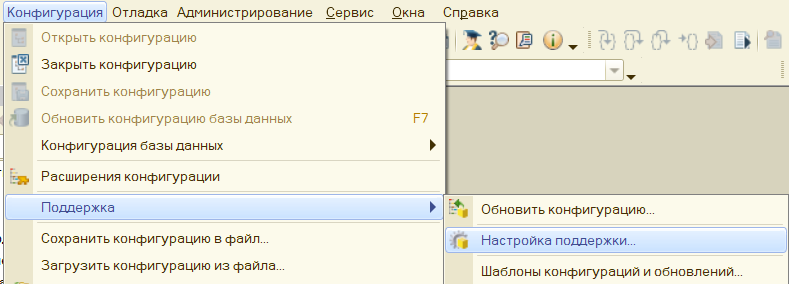

    В открывшемся окне переключаемся на **ТочкаМаршрутизации**

    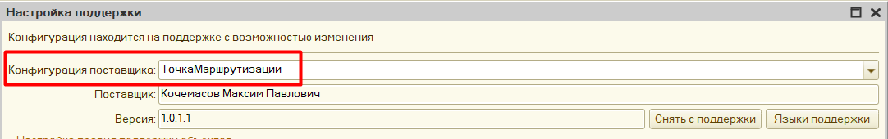

    В списке объектов находим определяемый тип **тм_МодульАпи** и устанавливаем правило поддержки *Объект поставщика редактируется с сохранением поддержки*

    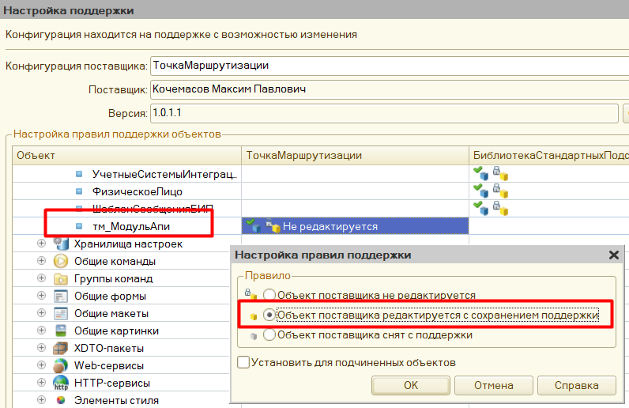

    Для определяемого типа **тм_МодульАпи** устанавливаем тип *СправочникСсылка.<Имя справочника внешних обработок>*. Например, для баз на основе БСП, *СправочникСсылка.ДополнительныеОтчетыИОбработки*

    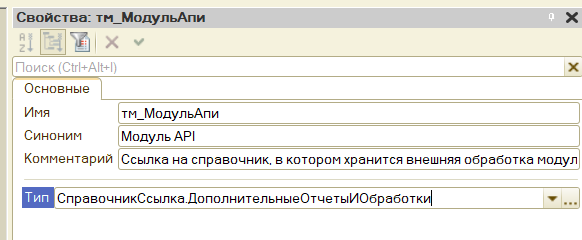

Готово! Далее требуется реализовать обработчики событий библиотеки

## 03. Реализация обработчиков событий библиотеки

Реализацию обработчиков событий библиотеки необходимо выполнить в общем модуле **тм_ДанныеВнешнихСервисовПереопределяемый**. Перед внесением изменений включим возможность редактирования - открываем меню *Конфигурация - Поддержка - Настройка поддержки...*. В открывшемся окне переключаемся на библиотеку **Точка маршрутизации**, в списке объектов находим общий модуль *тм_ДанныеВнешнихСервисовПереопределяемый* и устанавливаем правило *Объект поставщика редактируется с сохранением поддержки*

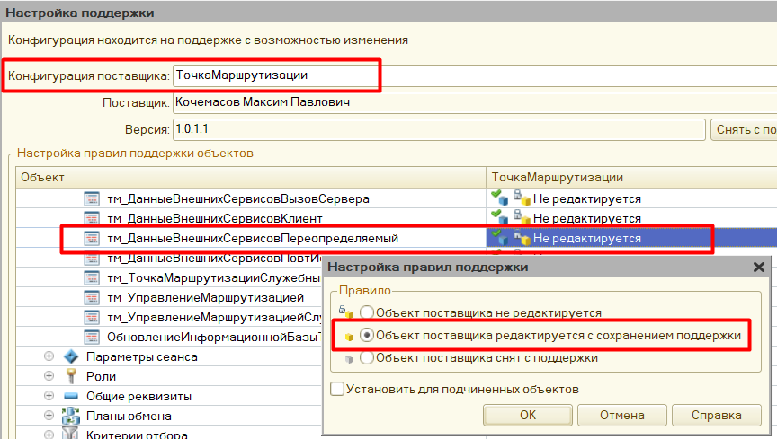

Теперь общий модуль доступен для редактирования. 

### Событие получения объекта внешней обработки (обязательно для реализации!).

За получения объекта внешней обработки *модуля API* и *модулей прикладных операций* отвечает обработчик *ПриПолученииВнешнейОбработкиМодуляВнешнегоСервиса*. 
На вход обработчику поступает два параметра:
1. **ЭлементХраненияОбработки** - это ссылка на элемент справочника, в котором хранятся *модули API* и *модули прикладных операций*. Тип справочника устанавливается в определяемом типе [тм_МодульАПИ](#typeModule)
2. **ОбработкаМодуля** - выходной параметр, в который нужно поместить объект внешней обработки *модуля API* и *модуля прикладных операций*.

Пример реализации обработчика для информационных баз на основе БСП:
```bsl
Процедура ПриПолученииВнешнейОбработкиМодуляВнешнегоСервиса(ЭлементХраненияОбработки, ОбработкаМодуля) Экспорт

	ОбработкаМодуля = ДополнительныеОтчетыИОбработки.ОбъектВнешнейОбработки(ЭлементХраненияОбработки);

КонецПроцедуры
```

### События получения данных аутентификаций для внешних сервисов

В библиотеке есть возможность устанавливать **данные аутентификации** для внешних сервисов. Это могут быть *токены авторизации, ключи разработчика, различные логины и пароли и т.д.*. Ввод данных аутентификаций внешнего сервиса выполняется из формы элемента справочника **тм_ВнешниеСервисы**:

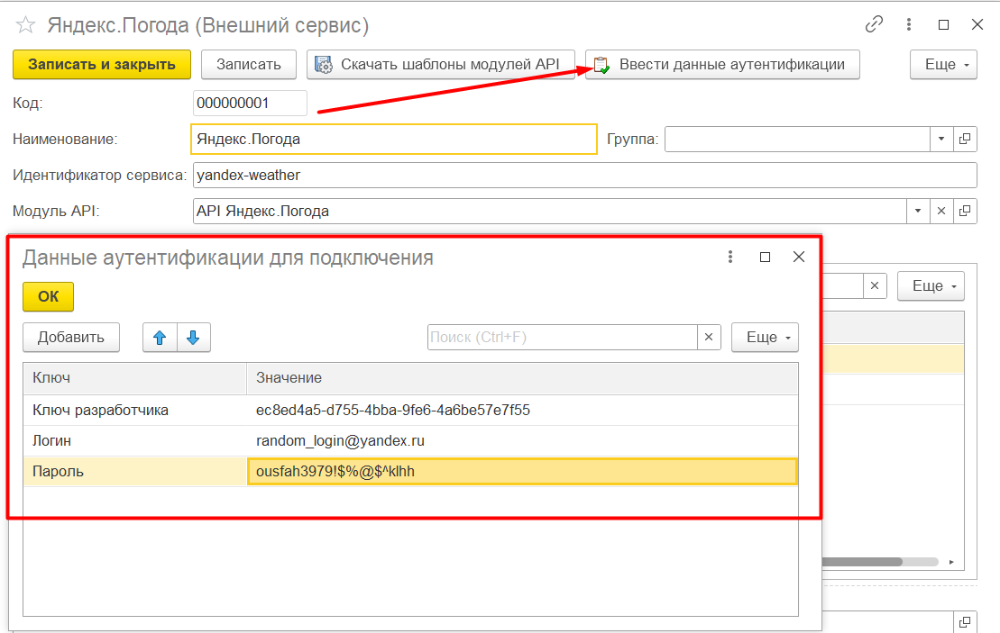

Подобная информация несет высокий конфиденциальный характер, поэтому запись, чтение и удаление данных аутентификаций предлагается реализовать разработчикам самостоятельно. В библиотеке для этого предусмотрены следующие обработчики:

- **ПриЗаписиДанныхАутентификацийВХранилище** - Обработчик записи данных аутентификации внешнего сервиса в хранилище. В данном обработчике необходимо реализовать алгоримт записи данных аутентификации в соответствующее хранилище. Хранилищем может выступать как таблица текущей информационной базы так и любая другая внешняя система хранения. При наличии БСП можно использовать запись в безопасное хранилище. Вызывается в момент записи элемента справочника **тм_ВнешниеСервисы**
    Параметры:
    1. **ИдентификаторАутентификации** - уникальный идентификатор, по которому можно получить данные аутентификации внешнего сервиса
    2. **ДанныеАутентификации** - Соответствие. Введенные данные аутентификации для внешнего сервиса

    Пример реализации:

    ```bsl
    Процедура ПриЗаписиДанныхАутентификацийВХранилище(ИдентификаторАутентификации, ДанныеАутентификации) Экспорт

        КлючДанныхАутентификацииВХранилище = "LogPass";

        УстановитьПривилегированныйРежим(Истина);
    
        ОбщегоНазначения.ЗаписатьДанныеВБезопасноеХранилище(ИдентификаторАутентификации, ДанныеАутентификации,
            КлючДанныхАутентификацииВХранилище);

        УстановитьПривилегированныйРежим(Ложь);

    КонецПроцедуры
    ```

- **ПриПолученииДанныхАутентификацииИзХранилища** - В данном обработчике необходимо реализовать алгоритм получения данных аутентификации внешнего сервиса из соответствующего хранилища по переданному идентфикатору аутентификации. При наличии БСП можно использовать механизм безопасного хранилища (если запись так же выполняется в безопасное хранилище). Вызывается в момент инициализации объекта внешней обработки **модуля API**.
    Параметры:
    1. **ИдентификаторАутентификации** - идентификатор данных аутентификации внешнего сервиса в хранилище, по которому нужно получить данные аутентификации
    2. **ДанныеАутентификации** - Соответствие. Выходной параметр. Данные аутентификации внешнего сервиса, найденные по переданному идентификатору

    Пример реализации:

    ```bsl
    Процедура ПриПолученииДанныхАутентификацииИзХранилища(ИдентификаторАутентификации, ДанныеАутентификации) Экспорт
	
        КлючДанныхАутентификацииВХранилище = "LogPass";
        
        УстановитьПривилегированныйРежим(Истина);
        
        ДанныеАутентификации = ОбщегоНазначения.ПрочитатьДанныеИзБезопасногоХранилища(ИдентификаторАутентификации,
            КлючДанныхАутентификацииВХранилище);
        
        УстановитьПривилегированныйРежим(Ложь);

    КонецПроцедуры
    ```

- **ПриУдаленииДанныхАутентификацииИзХранилища** - Вызывается при удалении ссылки на внешний сервис из информационной базы (см. справочник **тм_ВнешниеСервисы**) В данном обработчике необходимо реализовать алгоритм удаления данных аутентификаций внешнего сервиса с указанным идентификатором аутентификации. При использовании БСП можно воспользоваться механизмом безопасного хранилища (если данные аутентификации были записаны с помощью этого механизма).
    Параметры:
    1. **ИдентификаторАутентификации** - уникальный идентификатор данных аутентификации внешнего сервиса которые нужно удалить.

    Пример реализации:
    ```bsl
    Процедура ПриУдаленииДанныхАутентификацииИзХранилища(ИдентификаторАутентификации) Экспорт
	
        УстановитьПривилегированныйРежим(Истина);
        
        ОбщегоНазначения.УдалитьДанныеИзБезопасногоХранилища(ИдентификаторАутентификации);
        
        УстановитьПривилегированныйРежим(Ложь);

    КонецПроцедуры
    ```

Обработчики событий получения, записи и удаления данных аутентификаций внешнего сервиса **не являются обязательными** для реализации.

Пример реализации перечисленных событий также можно посмотреть в демо-базе.