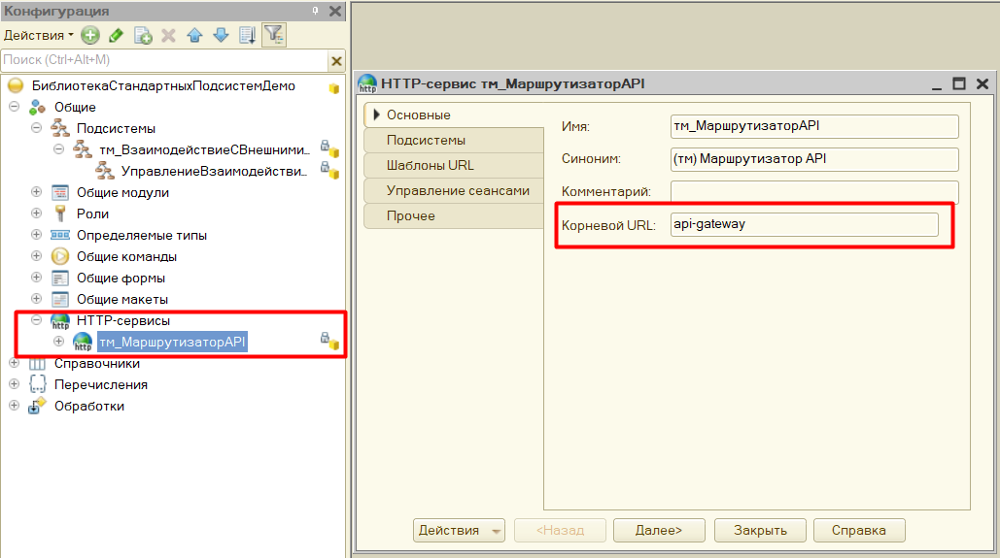
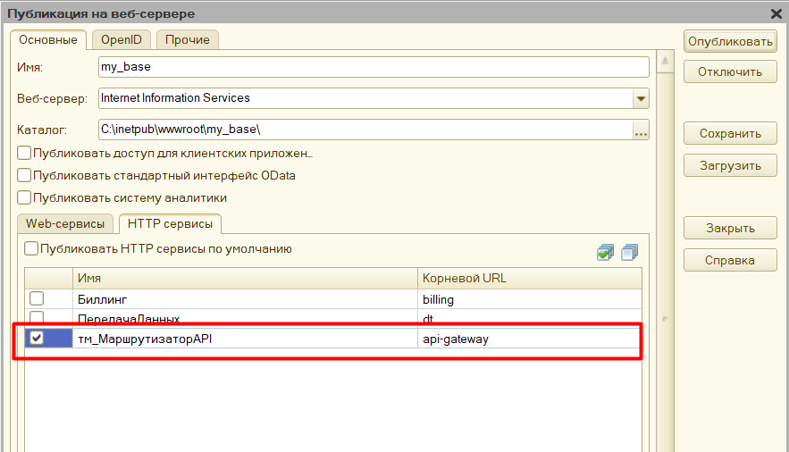
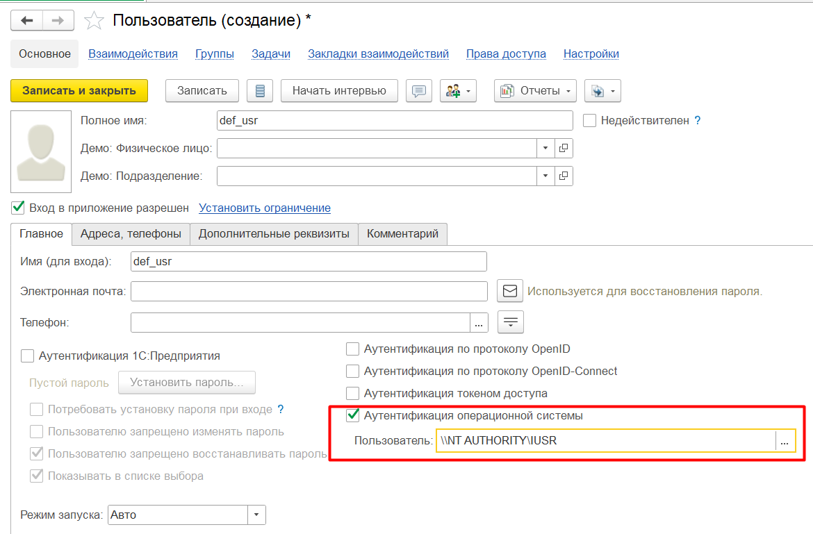
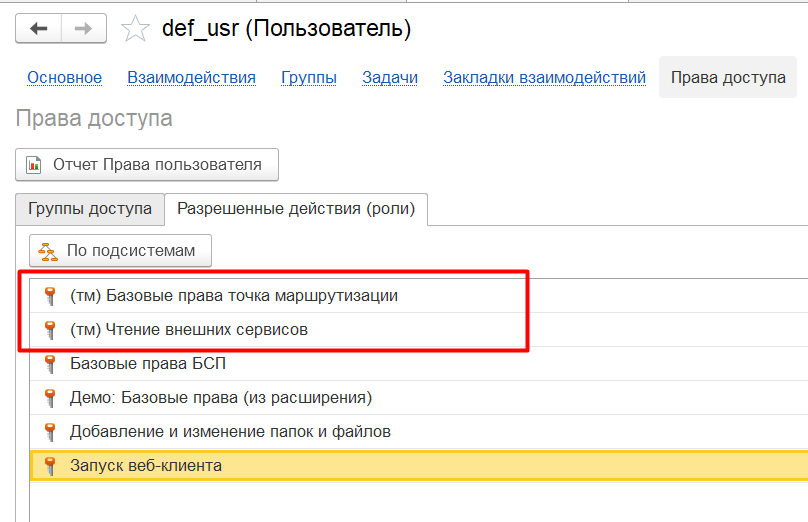

## 02. Публикация http-сервиса библиотеки

За подключение внешних клиентов отвечает http-сервис **тм_МаршрутизаторAPI** с корневым url **api-gateway**



Публикация http-сервиса **тм_МаршрутизаторAPI** выполняется стандартным образом:

1. Открываем конфигуратор информационной базы, в которую была внедрена библиотека *Точка маршрутизации* от имени администратора.
2. Переходим в меню *Администрирование - Публикация на веб-сервере*
3. Отмечаем http-сервис **тм_МаршрутизаторAPI** и нажимаем *Опубликовать*

    

4. Если требуется, то пользователю операционной системы, под которым исполняется служба веб-сервера (IIS, Apache) необходимо дать права на каталог, в котором расположена информационная база.

### Настройка прав пользователя

Определим пользователя, под которым будет выполняться обращение к http-сервису. Если http-сервис **тм_МаршрутизаторAPI** опубликован там же где расположена информационная база, то можно использовать пользователя, под которым запущена служба веб-сервера. В этом примере публикация http-сервиса **тм_МаршрутизаторAPI** была выполнена на IIS.

1. Добавляем нового пользователя. Для примера можно установить аутентификацию по операционной системе и выбрать пользователя **\\NT AUTHORITY\IUSR** - это пользователь IIS по умолчанию. Выбрав этого пользователя мы сможем обращаться к http-сервису без ввода логина и пароля

    

2. Для нового пользователя необходимо установить права **(тм) Базовые права** и **(тм) Чтение внешних сервисов**. Если требуется, то дополнительно установить пользователю права на чтение / изменение других объектов информационной базы.

    

3. Проверим публикацию - вызовем метод */health* опубликованного http-сервиса по адресу

    ```
    http://localhost/my_base/hs/api-gateway/health
    ```

    Если проблем нет, то получим результат:

    

