# 03.Модуль API и модули прикладных операций

## Шаблоны модулей

Для создания **модуля API** и **модулей прикладных операций** предусмотрены шаблоны внешних обработок с заготовленными обработчиками событий. Скачать шаблоны модулей можно из справочника **(тм) Внешние сервисы** библиотеки. Для этого:

1. Переходим в раздел **(тм) Взаимодействие с вшеними сервисами** и открываем справочник **(тм) Внешние сервисы**

    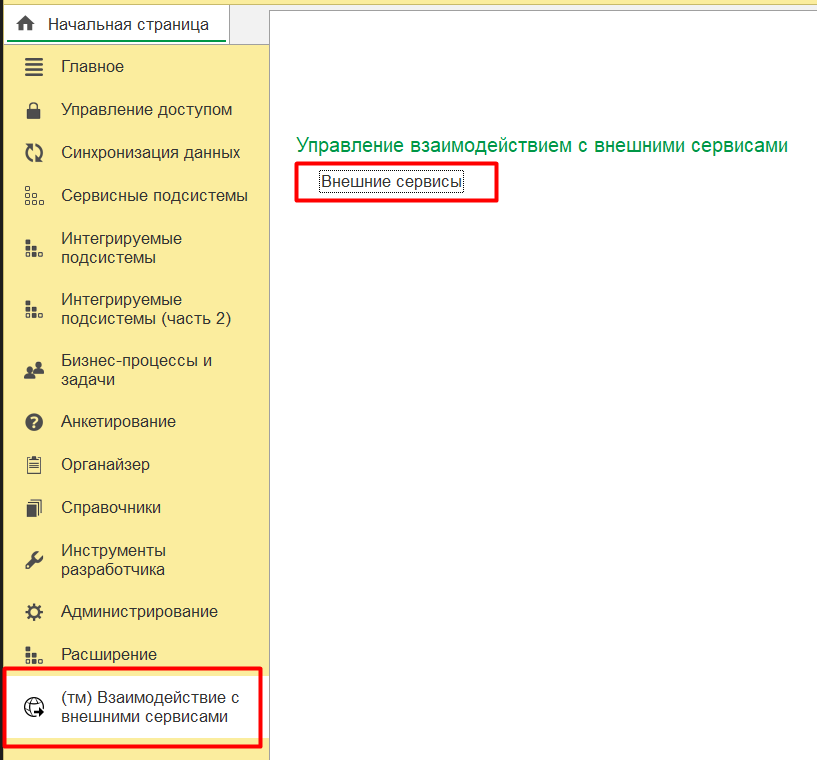

2. Нажимаем кнопку **Скачать шаблоны модулей API**

    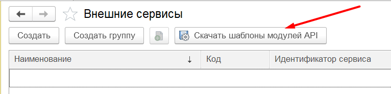

3. В появившемся окне нажимаем **Сохранить** и сохраняем zip-архив с шаблонами на локальный диск

    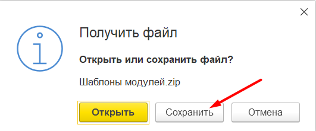

4. Распаковываем сохраненный архив - в папке будут два файла: **Шаблон модуля API** и **Шаблон модуля прикладной операции**

    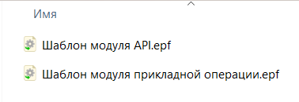

## Создание модуля API из шаблона

Модуль API можно создать используя шаблон внешней обработки **Шаблон модуля API**. В качестве примера рассмотрим создание модуля API для сервиса погоды [openweathermap.org](https://openweathermap.org/api)

1. Открываем модуль объекта обработки **Шаблон модуля API**, меняем имя обработки на *OpenWeatherMapApi* и выполняем команду меню конфигуратора *Файл - Сохранить как...* и сохраняем обработку в новый файл

    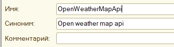

2. В модуле обработки предусмотрена область *ДляВызоваИзДругихПодсистем* в которой реализовано подключение внешней обработки модуля API к справочнику *ДополнительныеОтчетыИОбработки* БСП. Если модуль API планируется хранить в другом справочнике внешних обработок, то данную область нужно закомментировать

    ```bsl

    // Данную область нужно заккоментировать / удалить, если модуль API НЕ будет храниться в справочнике ДополнительныеОтчетыИОбработки

    #Область ДляВызоваИзДругихПодсистем

    // СтандартныеПодсистемы.ДополнительныеОтчетыИОбработки

    // см. ДополнительныеОтчетыИОбработки.СведенияОВнешнейОбработке()
    Функция СведенияОВнешнейОбработке() Экспорт
        
        ПараметрыРегистрации = ДополнительныеОтчетыИОбработки.СведенияОВнешнейОбработке("3.1.11.269");
        ПараметрыРегистрации.Вид = ДополнительныеОтчетыИОбработкиКлиентСервер.ВидОбработкиДополнительнаяОбработка();
        ПараметрыРегистрации.Версия = "1.0.1.1";
        ПараметрыРегистрации.БезопасныйРежим = Ложь;
        
        Возврат ПараметрыРегистрации;
        
    КонецФункции

    // см. ДополнительныеОтчетыИОбработкиКлиентСервер.ТипКомандыВызовСерверногоМетода()
    Функция ВыполнитьКоманду(ИдентификаторКоманды, ПараметрыВыполнения) Экспорт
        
    КонецФункции

    // Конец СтандартныеПодсистемы.ДополнительныеОтчетыИОбработки

    #КонецОбласти
    ```

3. [Бесплатный тариф сервиса](https://openweathermap.org/current) содержит только метод получения текущей погоды в указанной точке. Сделаем заготовку в области *ПрограммныйИнтерфейс* модуля API:

    ```bsl

    #Область ПрограммныйИнтерфейс

    // https://openweathermap.org/current
    // Возвращает текущие данные о погоде в указанной точке
    //
    // Параметры:
    //  Широта - Строка - широта в формате "**.**". Допустимы значения в диапазоне [-90; 90] Пример: "33.44"
    //  Долгота - Строка - долгота в формате "**.**". Допустимы значения в диапазоне [-180; 180]. Пример: "94.04"
    // 
    // Возвращаемое значение:
    //   - Соответствие - десериализованная из JSON информация о погоде
    //
    Функция ТекущиеДанныеПогоды(Широта, Долгота) Экспорт
                      
    КонецФункции

    #КонецОбласти

    ```

4. Реализуем описанный метод так:

    ```bsl
    Функция ТекущиеДанныеПогоды(Широта, Долгота) Экспорт
        
        URL = "https://api.openweathermap.org/data/2.5/weather";
        КлючАПИ = ДанныеАутентификации["Ключ АПИ"];
        
        ПараметрыURL = Новый Соответствие;
        ПараметрыURL.Вставить("lat", Широта);
        ПараметрыURL.Вставить("lon", Долгота);
        ПараметрыURL.Вставить("units", "metric");
        ПараметрыURL.Вставить("appid", КлючАПИ);
        
        Возврат КоннекторHTTP.GetJson(URL, ПараметрыURL);
        
    КонецФункции
    ```

    Для удобства можно использовать [*КоннекторHTTP*](https://github.com/vbondarevsky/Connector)

    Обратите внимание на строку:

    ```bsl
    КлючАПИ = ДанныеАутентификации["Ключ АПИ"];
    ```

    Здесь **ДанныеАутентификации** - это реквизит обработки модуля API, в которое помещается соответствие с данными аутентификациями внешнего сервиса:

    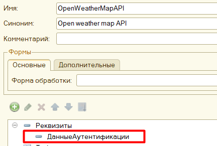

    Данные аутентификации будут заполнены [**только когда реализован обработчик получения данных авторизаций внешнего сервиса**](./01_implementation.md#события-получения-данных-аутентификаций-для-внешних-сервисов)

    В соответствие **ДанныеАутентификации** будут помещены введенные данные авторизации внешнего сервиса, к которому относится модуль API

    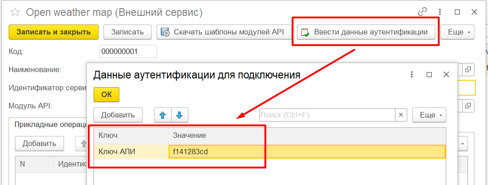

 ### Обработчики событий модуля API

В модуле API есть обработчики входящих http-запросов *GET, POST, PUT, DELETE, PATCH*. Пример заготовки обработчика из шаблона:

```bsl
// Точка входа обработки POST-запроса
//
// Параметры:
//  ЗапросHTTP - HTTPСервисЗапрос - входящий POST-запрос для обработки
//  ИдентификаторКоманды - Строка - идентификатор команды, которую нужно выполнить
// 
// Возвращаемое значение:
//   - HTTPСервисОтвет - результат выполнения текущей прикладной операции
//
Функция ОбработатьPOSTЗапрос(ЗапросHTTP, ИдентификаторКоманды) Экспорт
   
    Заголовки = Новый Соответствие;
    Заголовки.Вставить("Content-type", "text/html;charset=utf-8");
     
    Ответ = Новый HTTPСервисОтвет(405, , Заголовки);
    Ответ.УстановитьТелоИзСтроки(НСтр("ru = 'Метод не поддерживается'"), КодировкаТекста.UTF8);
    
    Возврат Ответ;
      
КонецФункции
```
В заготовках установлены "заглушки". Если требуется обрабатывать в модуле API входящие запросы, то вместо "заглушки" необходимо реализовать свои алгоритмы подготовки ответа. 

Вообще модуль API **не предназначен для обработки входящих запросов напрямую** - для этого нужно использовать модули прикладных операций.

Но бывают ситуации когда:
- Для взаимодействия с внешним сервисом достаточно одного модуля API без прикладных операций и в качестве ответа клиенту необходимо передавать "сырой" не обработанный ответ внешнего сервиса (на усмотрение разработчика)
- На время отладки посмотреть исходный ответ внешнего сервиса

Для отправки входящего запроса в модуль API внешнего сервиса необходимо сформировать http-запрос по шаблону:

```
http://<ip-адрес-публикации>/<имя-публикации>/hs/api-gateway/{serviceId}/mainModule/{commandId}
```

Здесь:
- **serviceId** - идентификатор внешнего сервиса элемента справочника *(тм) Внешние сервисы*
- **commandId** - параметр **ИдентификаторКоманды**, поступающий в обработчик входящего запроса модуля API

Соответствие видов входящих http-запросов и обработчиков событий модуля API приведено в таблице ниже:

|**Вид запроса**|**Шаблон URL**|**Обработчик события модуля API**|
|-|-|-|
|*GET*| {serviceId}/mainModule/operationId | ОбработатьGETЗапрос|
|*POST*| {serviceId}/mainModule/operationId | ОбработатьPOSTЗапрос|
|*PUT*| {serviceId}/mainModule/operationId | ОбработатьPUTЗапрос|
|*PATCH*| {serviceId}/mainModule/operationId | ОбработатьPATCHЗапрос|
|*DELETE*| {serviceId}/mainModule/operationId | ОбработатьDELETEЗапрос|


Для примера реализуем обработчик GET-запроса текущего модуля API:
```bsl
Функция ОбработатьGETЗапрос(ЗапросHTTP, ИдентификаторКоманды) Экспорт
	
	Если ИдентификаторКоманды = "raw" Тогда
		
		Широта = ЗапросHTTP.ПараметрыЗапроса.Получить("lat");
		Долгота = ЗапросHTTP.ПараметрыЗапроса.Получить("lon");
		
		ДанныеПогоды = ТекущиеДанныеПогоды(XMLСтрока(Широта), XMLСтрока(Долгота));
		КакJSON = ОбщегоНазначения.ЗначениеВJSON(ДанныеПогоды);
		
		Заголовки = Новый Соответствие;
		Заголовки.Вставить("Content-type", "application/json;charset=utf-8");
		
		Ответ = Новый HTTPСервисОтвет(200, , Заголовки);
		Ответ.УстановитьТелоИзСтроки(КакJSON, КодировкаТекста.UTF8);
		
	Иначе
		
		Заголовки = Новый Соответствие;
		Заголовки.Вставить("Content-type", "text/html;charset=utf-8");
		
		Ответ = Новый HTTPСервисОтвет(405, , Заголовки);
		Ответ.УстановитьТелоИзСтроки(НСтр("ru = 'Метод не поддерживается'"), КодировкаТекста.UTF8);
		
	КонецЕсли;
	
	Возврат Ответ;
	
КонецФункции
```

Для проверки добавим в справочник внешних сервисов библиотеки запись с идентификатором сервиса *open-weather-map*. Также добавим наш созданный модуль API в справочник внешних обработок и укажем его в соответствующем реквизите внешнего сервиса:

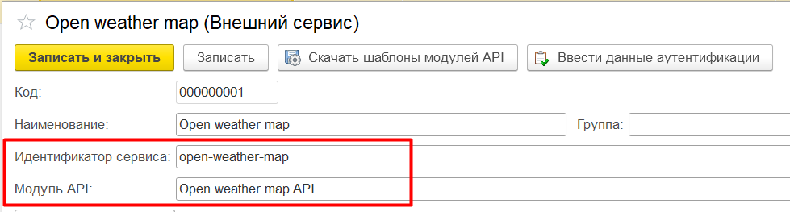

Также укажем данные авторизации c ключом "Ключ АПИ":

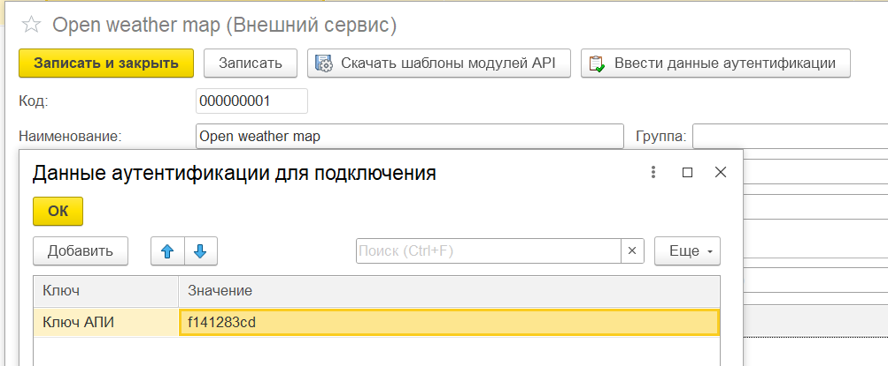

Нажимаем **Записать и закрыть**

Тогда для проверки необходимо выполнить запрос к http-сервису библиотеки по шаблону:
```
http://<ip-адрес публикации>/<имя публикации>/hs/api-gateway/open-weather-map/mainModule/raw?lat={широта}&lon={долгота}
```

Здесь:
- **open-weather-map** - это идентификатор внешнего сервиса в справочнике библиотеки
- **raw** - это идентификатор команды. Придет в параметре *ИдентификаторКоманды* обработчика *ОбработатьGETЗапрос*
- **lat** и **lon** - это параметры запроса

В моем случае для получения результата нужно выполнить запрос:
```
http://localhost/my_base/hs/api-gateway/open-weather-map/mainModule/raw?lat=55.24&lon=55.43
```

Результат выполнения:

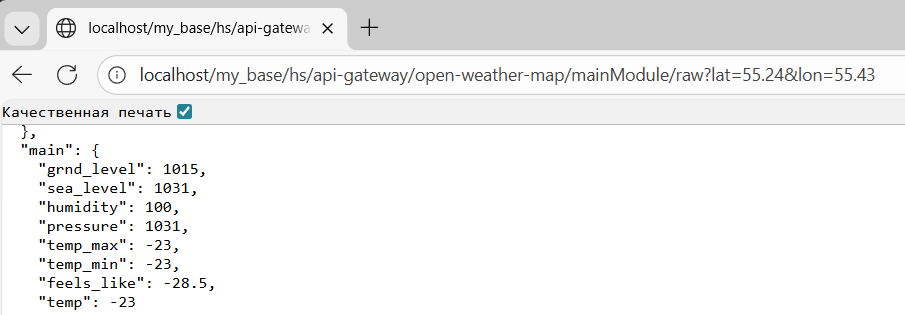

## Создание модуля прикладной операции из шаблона.

Для создания модуля прикладной операции необходимо использовать внешнюю обработку **Шаблон модуля прикладной операции**
Обработка модуля прикладной операции содержит только один реквизит **МодульAPI**:

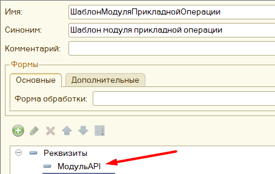

Реквизит **МодульAPI** содержит объект [внешней обработки модуля API](#создание-модуля-api-из-шаблона), заданный для внешнего сервиса, для которого вызывается прикладная операция. Инициализация модуля API выполняется в момент исполнения входящего запроса к прикладной операции внешнего сервиса и определяется в [событии *ПриПолученииВнешнейОбработкиМодуляВнешнегоСервиса*](./01_implementation.md#событие-получения-объекта-внешней-обработки-обязательно-для-реализации) переопределяемого общего модуля *тм_ДанныеВнешнихСервисовПереопределяемый*. 

Благодаря этому в прикладных операций становятся доступными экспортные методы *модуля API*, в которых реализовано обращение к API внешнего сервиса, что позволяет повторно использовать алгоритмы взаимодействия с внешним сервисом в различных сценариях. Пример взаимодействия с модулем API в модуле прикладной операции:

```bsl

ПараметрыЗапросаКСервису = МодульAPI.НовыеПараметрыЗапросаКСервису();
// ... заполнение параметров

ОтветСервиса = МодульAPI.ОтветСервиса(ПараметрыЗапросаКСервису);

```

Модуль прикладной операции содержит обработчики входящих http-запросов *GET, POST, PUT, DELETE, PATCH*. Пример одного из обработчиков:

```bsl
// Точка входа обработки GET-запроса
//
// Параметры:
//  ЗапросHTTP - HTTPСервисЗапрос - входящий GET-запрос для обработки
// 
// Возвращаемое значение:
//   - HTTPСервисОтвет - результат выполнения текущей прикладной операции
//
Функция ОбработатьGETЗапрос(ЗапросHTTP) Экспорт
	
КонецФункции
```

По умолчанию в шаблоне модуля приклданой операции установлены заглушки:
```bsl

	Заголовки = Новый Соответствие;
	Заголовки.Вставить("Content-type", "text/html;charset=utf-8");
	
	Ответ = Новый HTTPСервисОтвет(405, , Заголовки);
	Ответ.УстановитьТелоИзСтроки(НСтр("ru = 'Метод не поддерживается'"), КодировкаТекста.UTF8);
	
	Возврат Ответ;

```

Вместо этой заглушки разработчик должен реализовать алгоритм формирования ответа на соответствующий http-запрос к прикладной операции. 

Обращение к прикладной операции выполняется по шаблону http-запроса клиента:

```
http://<ip-адрес публикации>/<имя публикации>/hs/api-gateway/{serviceId}/{operationId}
```

Здесь:
- **serviceId** - это идентификатор внешнего сервиса, прикладную операцию которого нужно выполнить
- **operationId** - это идентификатор прикладной операции внешнего сервиса

Ниже представлена таблица соответствия обработчиков модуля прикладной операции и видов входящих http-запросов:

|**Вид запроса**|**Шаблон запроса**|**Обработчик входящего запроса**|
|-|-|-|
|*GET*|{serviceId}/{operationId}|ОбработатьGETЗапрос|
|*POST*|{serviceId}/{operationId}|ОбработатьPOSTЗапрос|
|*PUT*|{serviceId}/{operationId}|ОбработатьPUTЗапрос|
|*PATCH*|{serviceId}/{operationId}|ОбработатьPATCHЗапрос|
|*DELETE*|{serviceId}/{operationId}|ОбработатьDELETEЗапрос|

Таким образом, прикладная операция может обрабатывать 5 различных видов http-запросов и для каждого вида входящего клиентского запроса можно реализовать свое поведение.

В шаблоне модуля прикладной операции также есть область *ДляВызоваИзДругихПодсистем*, в которой находятся методы, требующиеся для добавления обработки в справочник *ДополнительныеОтчетыИОбработки* БСП. Если обработку модуля операции планируется хранить в другом справочнике, то данную область нужно удалить.

#### Пример создания модуля прикладной операции из шаблона

В примере будет использовано обращение к [*модулю API* из подраздела выше](#создание-модуля-api-из-шаблона). Создадим прикладную операцию к сервису OpenWeatherMap для получения погоды в Москве

1. Открываем шаблон модуля прикладной операции, изменяем имя на "ПогодаВМоскве" и выполняем команду *Файл - Сохранить как*. Сохраняем обработку в любом каталоге

    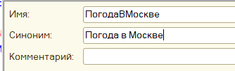

2. Реализуем обработчик входящего GET запроса следующим образом:

    ```bsl
    Функция ОбработатьGETЗапрос(ЗапросHTTP) Экспорт
        
        // Координаты Москвы
        Широта = "55.45";
        Долгота = "37.37";
        
        // Выполним обращение к сервису OpenWeatherMap
        ДанныеПогодыВМоскве = МодульAPI.ТекущиеДанныеПогоды(Широта, Долгота);
        
        // Сформируем итоговый результат для клиента
        ТекущаяТемпература = ДанныеПогодыВМоскве["main"]["temp"];
        МаксимальнаяТемпература = ДанныеПогодыВМоскве["main"]["temp_max"];
        МинимальнаяТемпература = ДанныеПогодыВМоскве["main"]["temp_min"]; 
        ОщущаетсяКак = ДанныеПогодыВМоскве["main"]["feels_like"];
        
        РезультатДляКлиента = Новый Структура;
        РезультатДляКлиента.Вставить("ТекущаяТемпература", ТекущаяТемпература);
        РезультатДляКлиента.Вставить("МаксимальнаяТемпература", МаксимальнаяТемпература);
        РезультатДляКлиента.Вставить("МинимальнаяТемпература", МинимальнаяТемпература);
        РезультатДляКлиента.Вставить("ОщущаетсяКак", ОщущаетсяКак);
        
        РезультатДляКлиентаКакJSON = ОбщегоНазначения.ЗначениеВJSON(РезультатДляКлиента);
        
        Заголовки = Новый Соответствие;
        Заголовки.Вставить("Content-type", "application/json;charset=utf-8");
        
        Ответ = Новый HTTPСервисОтвет(200, , Заголовки);
        Ответ.УстановитьТелоИзСтроки(РезультатДляКлиентаКакJSON, КодировкаТекста.UTF8);
        
        Возврат Ответ;
        
    КонецФункции
    ```
3. Сохраним изменения. Добавим модуль прикладной операции получения погоды в Москве в справочник внешних обработок. Создадим (если ещё не создано) описание внешнего сервиса OpenWeatherMap в справочнике *(тм) Внешние сервисы* со следующими значениями:

    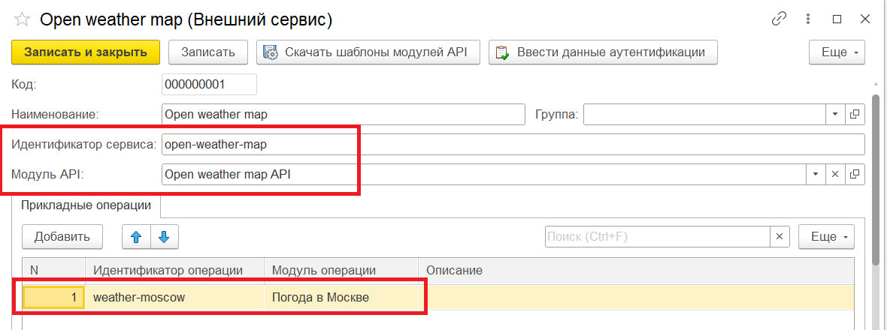

    Также нужно указать *Ключ АПИ* в данных аутентификациях и сохранить (*Записать и закрыть*):

    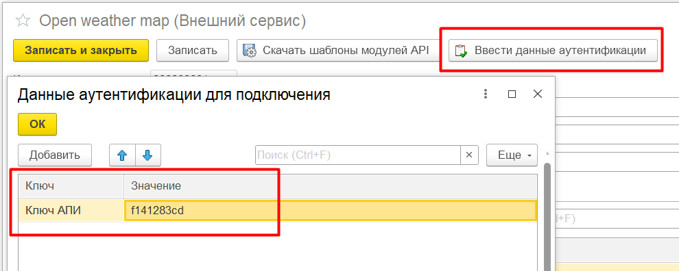


Теперь, чтобы получить информацию о погоде в Москве необходимо выполнить запрос вида:

```
http://<ip-адрес публикации>/<имя публикации>/hs/api-gateway/open-weather-map/weather-moscow
```

В моем случае запрос будет таким:
```
http://localhost/my_base/hs/api-gateway/open-weather-map/weather-moscow
```

Результат:

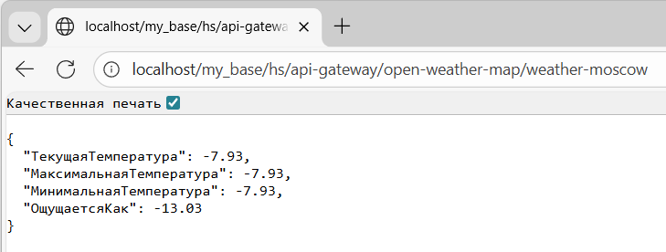

Создадим ещё один модуль прикладной операции **ТемператураИДавлениеВЛокации**, которая будет возвращать значение температуры и давления в локации с переданной широтой и долготой:

1. Открываем шаблон модуля прикладной операции, меняем имя на **ТемператураИДавлениеВЛокации** и сохраняем в любом каталоге.
2. Реализуем обработчик входящего GET запроса следующим образом:

    ```bsl
    Функция ОбработатьGETЗапрос(ЗапросHTTP) Экспорт
        
        // Получим координаты из параметра входящего запроса
        Широта = ЗапросHTTP.ПараметрыЗапроса.Получить("lat");
        Долгота = ЗапросHTTP.ПараметрыЗапроса.Получить("lon");
        
        // Выполним обращение к сервису OpenWeatherMap
        ДанныеПогоды = МодульAPI.ТекущиеДанныеПогоды(Широта, Долгота);
        
        // Сформируем итоговый результат для клиента
        Температура = ДанныеПогоды["main"]["temp"];
        Давление = ДанныеПогоды["main"]["pressure"];
        
        РезультатДляКлиента = Новый Структура;
        РезультатДляКлиента.Вставить("Температура", Температура);
        РезультатДляКлиента.Вставить("Давление", Давление);

        РезультатДляКлиентаКакJSON = ОбщегоНазначения.ЗначениеВJSON(РезультатДляКлиента);
        
        Заголовки = Новый Соответствие;
        Заголовки.Вставить("Content-type", "application/json;charset=utf-8");
        
        Ответ = Новый HTTPСервисОтвет(200, , Заголовки);
        Ответ.УстановитьТелоИзСтроки(РезультатДляКлиентаКакJSON, КодировкаТекста.UTF8);
        
        Возврат Ответ;
        
    КонецФункции
    ```
3. Загружаем модуль прикладной операции **ТемператураИДавлениеВЛокации** в справочник внешних обработок и добавляем в описание внешнего сервиса прикладную операцию с идентификатором **temperature-presure**

    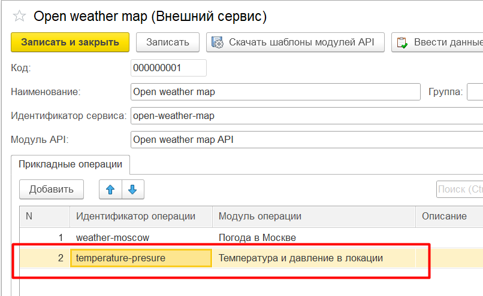


Для выполнения запроса к добавленной прикладной операции необходимо выполнить обращение по URL:
```
http://<ip-адрес публикации>/<имя публикации>/hs/api-gateway/open-weather-map/temperature-presure/?lat=55.45&lon=37.37
```

Здесь используются параметры запроса:
- **lat** - широта локации
- **lon** - долгота локации

В моем случае запрос выглядит так:
```
http://localhost/my_base/hs/api-gateway/open-weather-map/temperature-presure/?lat=55.45&lon=37.37
```

Результат:

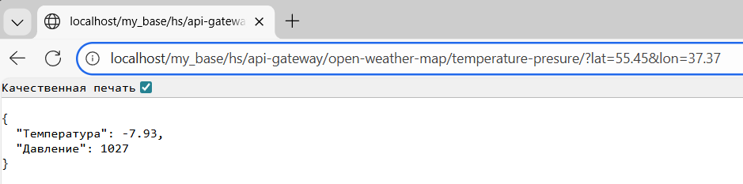