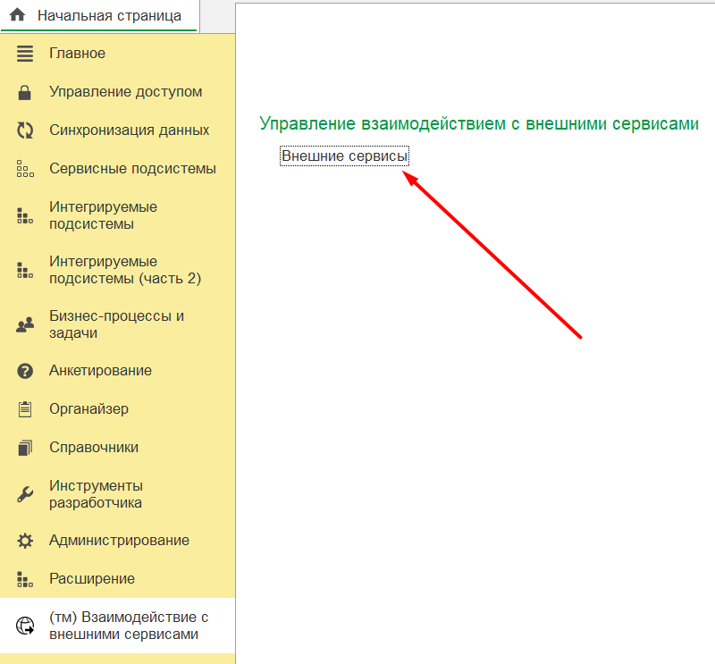
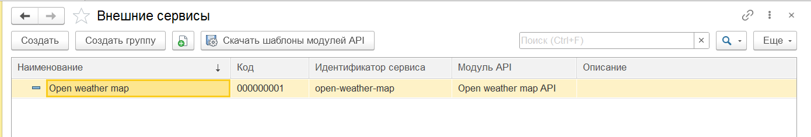
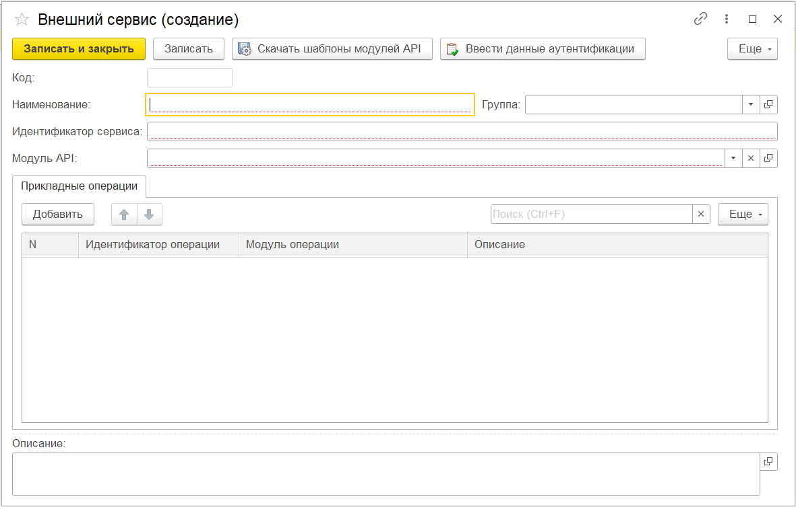
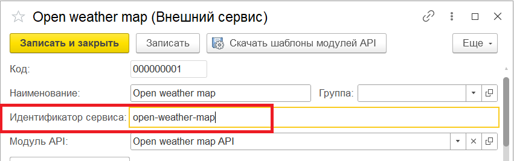
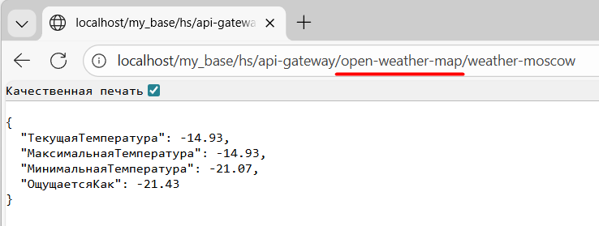
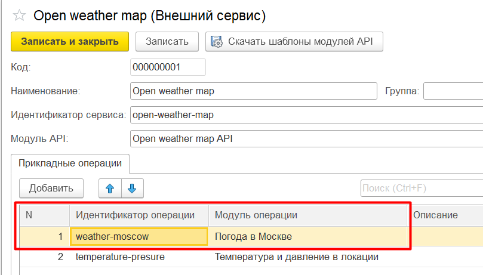
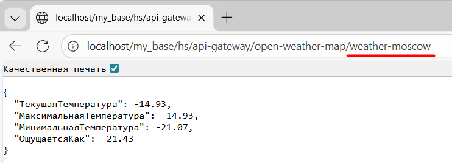
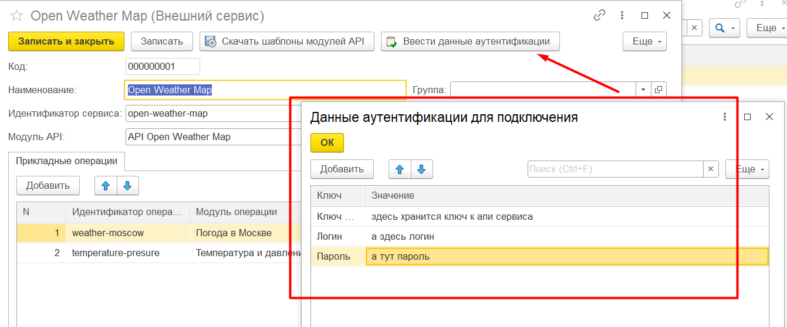

# 04. Добавление внешнего сервиса

Для хранения информации о внешних сервисах, с которыми возможно взаимодействие через библиотеку **Точка маршрутизации**, использутеся справочник **(тм) Внешние сервисы**.

Справочник находится в разделе **(тм) Взаимодействие с внешними сервисами**:





Перед добавлением внешнего сервиса необходимо [создать и загрузить внешние обработки модуля API и прикладных операций](03_api_module_operation.md)

Элемент справочника *(тм) Внешние сервисы* добавляется стандартным образом. Форма для заполнения данных выглядит следующим образом:



Реквизиты **Наименование**, **Идентификатор сервиса** и **Модуль API** являются обязательными для заполнения.

## Идентификатор сервиса

Реквизит **Идентификатор сервиса** позволяет однозначно идентифицировать внешний сервис, к которому должно быть выполнено обращение. Входящие клиентские запросы выполняются в формате:
```
http://<id-адрес публикации>/<имя публикации>/hs/api-gateway/{serviceId}/{operationId}
```
Либо если клиентский запрос адресован напрямую в *модуль API*:

```
http://<id-адрес публикации>/<имя публикации>/hs/api-gateway/{serviceId}/mainModule/{commandId}
```

**Идентификатор сервиса** - это значение параметра *{serviceId}*, указываемый в URL клиентского входящего http-запроса

**Пример:**
В справочнике определен внешний сервис с идентификатором **open-weather-map**. Тогда для обращения к данному сервису нужно использовать запрос:
```
open-weather-map/{operationId}
```

Либо если делать запрос напрямую к модулю API:
```
open-weather-map/mainModule/{commandId}
```




## Прикладные операции

Прикладная операция характеризуется двумя обязательными составляющими:
- **Идентификатор операции** - позволяет однозначно определить, какую прикладную операцию внешнего сервиса необходимо выполнить для обработки входящего http-запроса клиента
- **Модуль прикладной операции** - это ссылка на элемент хранения внешней обработки, содержащей алгоритм формирования ответа на входящий http-запрос клиента

**Идентификатор операции** указывается в параметре *{operationId}* url входящего клиентского запроса:

```
hs/api-gateway/{serviceId}/{operationId}
```

**Пример**: в элементе справочника с идентификатором сервиса *open-weather-map* определена прикладная операция *weather-moscow*.
Тогда для выполнения указанной операции нужно использовать http-запрос:
```
hs/api-gateway/open-weather-map/weather-moscow
```





Будет вызван алгоритм формирования ответа для входящего запроса из внешней обработки *Погода в Москве*.

В рамках одного сервиса можно хранить несколько различных прикладных операций


## Данные аутентификации

Для каждого внешнего сервиса можно хранить свои данные аутентификации (Токены, логины, пароли) [при условии что соответствующее хранение было реализовано при внедрении библиотеки](01_implementation.md#события-получения-данных-аутентификаций-для-внешних-сервисов).
Ввод данных аутентификации для внешнего сервиса выполняется командой **Ввести данные аутентификации**:



После ввода элемент справочника необходимо записать. Введенные данные аутентификации будут **в виде соответсвия во внешней обработке модуля API** [(см. реквизит **ДанныеАутентификации** внешней обработки модуля API)](03_api_module_operation.md#создание-модуля-api-из-шаблона)