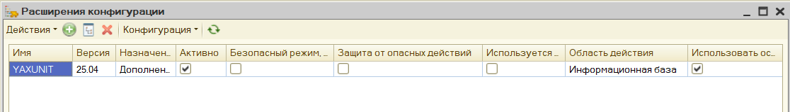
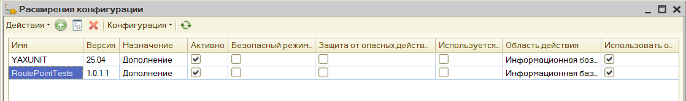
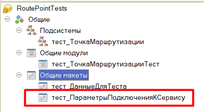
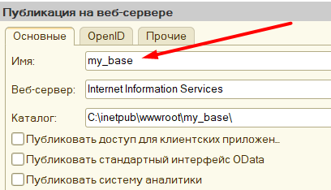
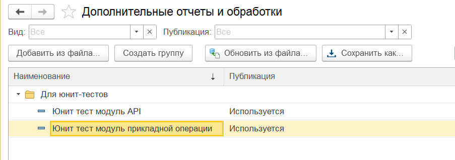
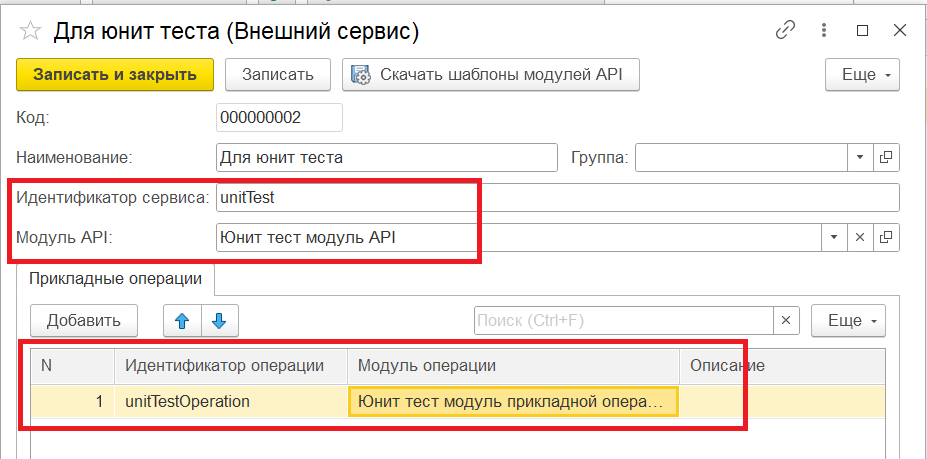
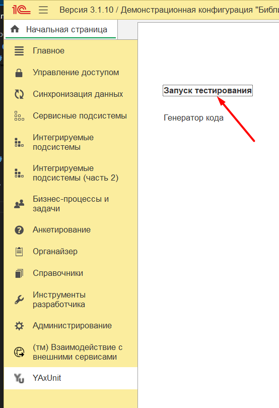
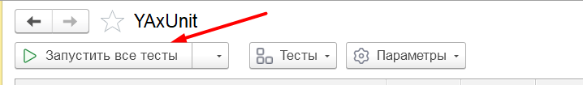
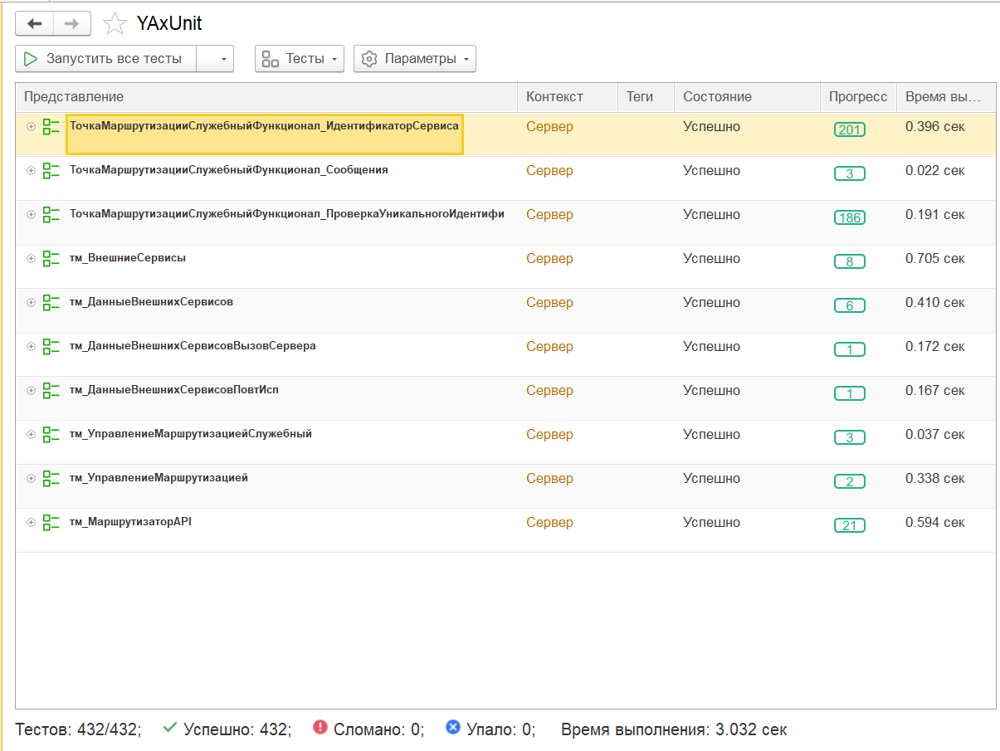

# 05. Unit-тесты

В разделе релизов есть архив *unit-tests.zip* в котором содержится расширение и вспомогательные обработки модуля API и модуля прикладной операции для запуска юнит-тестов.
Юнит-тесты созданы с использованием фреймворка [**YAXUNIT**](https://github.com/bia-technologies/yaxunit)

**Важно:** перед тестами необходимо выполнить [публикацию http-сервиса api-gateway](/02_http_service.md) и реализовать [обработчики хранения данных аутентификаций внешнего сервиса](01_implementation.md#события-получения-данных-аутентификаций-для-внешних-сервисов)

## Подготовка к запуску юнит-тестов

1. Скачиваем и добавляем в конфигурацию расширение [**YAXUNIT**](https://github.com/bia-technologies/yaxunit/releases/download/25.04/YAxUnit-25.04.cfe) (ссылка ведет на скачивание версии 25.04, другие релизы YAXUNIT можно посмотреть [здесь](https://github.com/bia-technologies/yaxunit/releases))
   Снимаем флаги "Защита от опасных действий" и "Безопасный режим*

    

2. Распаковываем архив *unit-tests.zip*. Из распакованного архива добавляем в конфигурацию расширение **RoutePointTests.cfe** и также снимаем флаги "Безопасный режим" и "Защита от опасных действий"

    

3. В расширении *RoutePointTests* находим общий макет *тест_ПараметрыПодключенияКСервису*

    

    В нем содержится строка json, которую необходимо заполнить:

    ```json
    {
        "Сервер": "",
        "ИмяПубликации": "",
        "Пользователь": "",
        "Пароль": ""
    }
    ```
    Здесь:
    - **Сервер** - это ip-адрес или имя хоста, где выполнена публикация http-сервиса [*api-gateway*](.02_http_service.md) библиотеки. Например, *localhost*
    - **Имя публикации** - задается при публикации http-сервиса (*Администрирование - Публикация на веб-сервере... - Имя*)

        

    - **Пользователь** - имя пользователя информационной базы, под которым выполняется подключение к http-сервису *api-gateway*. Если подключение выполняется под пользователем с авторизацией по ОС, то можно не заполнять
    - **Пароль** - пароль пользователя, под которым выполняется подключение к http-сервису *api-gateway*. Если подключение выполняется под пользователем с авторизацией по ОС, то можно не заполнять

    Пример настройки:
    ```json
    {
        "Сервер": "localhost",
        "ИмяПубликации": "my_base",
        "Пользователь": "",
        "Пароль": ""
    }
    ```
    Заполняем и сохраняем изменения

4. В справочник внешних обработок добавить модуль API и модуль прикладной операции - это файлы **unitTestModuleAPI.epf** и **unitTestOperation.epf**. Если конфигурация на базе БСП и обработки хранятся в справочнике *ДополнительныеОтчетыИОбработки*, то файлы необходимо взять из папки **For SSL**

    

5. В справочник *(тм) Внешние сервисы* необходимо добавить описание внешнего сервиса, который будет вызываться в рамках юнит-тестов со следующими реквизитами:
    - Идентификатор сервиса: **unitTest**
    - Модуль API: ссылка на модуль АPI *unitTestModuleAPI.epf*, добавленный на предыдущем шаге
    - Идентификатор операции: **unitTestOperation**
    - Модуль прикладной операции: ссылка на модуль прикладной операции *unitTestOperation.epf*, добавленный на предыдущем шаге

    

## Запуск тестов

1. Переходим в раздел *YaxUnit - Запуск тестирования*

    

2. Нажимаем кнопку *Запустить все тесты*:

    

Смотрим результат:




